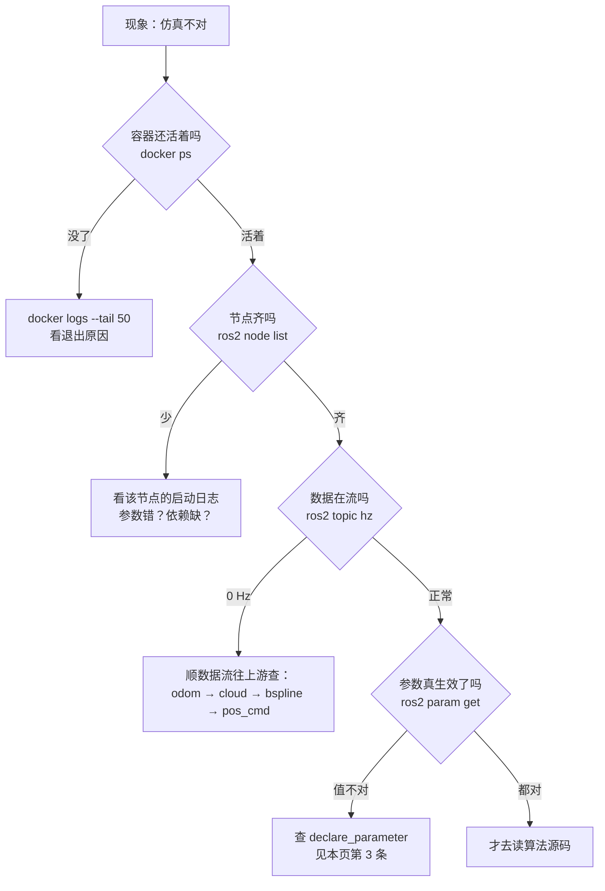

# 运行期问题

::: tip 这一页的规矩
**只记录本项目真实遇到过的问题**，一个都没有编造。每条都写清楚：现象、怎么定位、真正原因、怎么处理、以及"为什么会发生"。

如果你遇到的报错不在这里，说明本项目没碰到过——别指望这页能覆盖一切。
:::

## 1. A\* 报 `Ran out of pool`，规划失败

**现象**【运行验证】

日志里刷出这种错，同时 `plan_success=0`，无人机停在原地：

```
[ERROR] [Coord2Index]: Ran out of pool, index=... POOL_SIZE=100 100 100
```

**定位过程**

报错的 logger 名字就是 `Coord2Index`，直接拿它去源码里搜：

```bash
grep -rn "Ran out of pool" /home/yusei/Documents/Codex/ego-humble/src --include=*.h
```

找到唯一一处【源码确认：`path_searching/include/path_searching/dyn_a_star.h:107`】：

```cpp
idx = ((pt - center_) * inv_step_size_ + Eigen::Vector3d(0.5,0.5,0.5)).cast<int>() + CENTER_IDX_;
if (idx(0) < 0 || idx(0) >= POOL_SIZE_(0) || ... )
{
  RCLCPP_ERROR(..., "Ran out of pool, index=%d %d %d, POOL_SIZE=%d %d %d", ...);
  return false;
}
```

**真正原因**

A\* 的节点池是一个**固定大小的三维数组**，尺寸在初始化时硬编码【源码确认：`plan_manage/src/planner_manager.cpp:43`】：

```cpp
bspline_optimizer_->a_star_->initGridMap(grid_map_, Eigen::Vector3i(100, 100, 100));
```

栅格分辨率是 `0.1` 米，所以这个池子实际只覆盖 **10 m × 10 m × 10 m**。一旦 A\* 的起点或终点落在这个盒子外面，`Coord2Index` 就算出越界索引并拒绝搜索。

而 launch 里的 `planning_horizon` 是 **7.5 米**【源码确认：`single_run_in_sim.launch.py:113-115`】——离 10 米的边界只剩 2.5 米余量。**这个 demo 的默认参数本来就贴着上限跑。**

**处理**

单机默认参数下这个错并不持续出现，规划器会在下一个周期重新尝试。所以本项目**没有改任何代码**。如果你把参数调大踩到它，两个方向：

| 做法 | 代价 |
| --- | --- |
| 把 `planning_horizon` 调小（如 5.0） | 最简单，但看得更近、更保守 |
| 把 `initGridMap` 的 `100,100,100` 调大 | 要改第三方 C++ 并重新编译，内存占用按立方增长 |

::: warning 为什么这个坑值得记
它是"**硬编码常量 + 可配置参数**互相不知情"的典型。`planning_horizon` 是 launch 里可以随便改的参数，`100×100×100` 是编译进去的常量，两者没有任何检查关系。**改 launch 参数时要想一想有没有硬编码的上限在等着你。**
:::

## 2. 容器日志涨到 690 万行

**现象**【运行验证】

`sudo docker logs ego_sim` 半天刷不完，磁盘也在涨。实测日志累积到 **6,938,649 行**。

**原因**

规划器每 10 ms 跑一次状态机，而且**每次都 `cout` 打印当前状态**。一小时就是几十万行。Docker 默认的 `json-file` 日志驱动**没有大小上限**，会一直写到磁盘满。

**处理**

启动时限制日志大小并轮转（已写进 [第三步](/ego-planner/simulation) 的启动命令）：

```bash
--log-opt max-size=20m --log-opt max-file=2
```

意思是：单个日志文件最多 20 MB，最多留 2 个，超了就丢最旧的。上限 40 MB。

::: danger 顺手养成的两个习惯
1. **看日志永远加 `--tail`**：`sudo docker logs --tail 50 ego_sim`。不加的话终端会被几百万行糊住。
2. **长期运行的容器一律加 `--log-opt`**。这不是 ROS 的问题，是所有 Docker 长跑服务的通用注意事项。
:::

## 3. 每次重启地图都不一样，`seed` 参数根本没生效

**现象**【运行验证】

launch 文件里明明写了固定随机种子，但每次重启 `ego_sim`，柱子的位置都完全不同，实验没法复现。

**定位过程**

launch 里确实传了【源码确认：`single_run_in_sim.launch.py`】：

```python
{'ObstacleShape/seed': 1.0},
{'pub_rate': 1.0},
```

于是去 `random_forest` 的源码里找这两个参数，结果是——**找不到**：

```bash
grep -n "declare_parameter" \
  /home/yusei/Documents/Codex/ego-humble/src/ego-planner-swarm/src/uav_simulator/map_generator/src/random_forest_sensing.cpp
```

`:409-431` 一共 17 个 `declare_parameter` 调用，**里面既没有 `ObstacleShape/seed` 也没有 `pub_rate`**；`pub_rate` 这个字符串在整个文件里一次都没出现过【源码确认】。

种子的真正来源在 `:468`【源码确认】：

```cpp
unsigned int seed = rd();              // ← 真随机数
// unsigned int seed = 2433201515;     // ← 固定种子，被作者注释掉了
std::cout << "seed=" << seed << std::endl;
eng.seed(seed);
```

**真正原因：这是一个 ROS 1 → ROS 2 的移植遗漏。**

ROS 1 里 `nh.param("x", ...)` 可以直接读任何传进来的参数。**ROS 2 不行**：参数必须先 `declare_parameter` 声明，**没声明的参数从 launch 传进来会被静默忽略——不报错、不警告、什么都不说。**

所以这两个参数一直是"写了但没人读"。发布频率用的是已声明的 `sensing/rate`（默认 10.0），实测正是 10.001 Hz【运行验证】，和 launch 里那个 `pub_rate: 1.0` 毫无关系。

**处理**

本项目**没有改第三方源码**。想要可复现的地图，两条路：

1. 每次跑之前从日志里把 `seed=` 记下来（源码 `:470` 会打印），实验记录里写清楚用的是哪个种子。
2. 真要固定，就把 `:469` 那行注释放开——但这是改第三方代码，本项目没做。

::: danger 这一条是整个项目最值钱的教训
**在 ROS 2 里，"参数传了没生效"不会报错。** 排查顺序永远是：

1. 先确认节点**声明**过这个参数：`grep declare_parameter <源文件>`
2. 再用 `ros2 param list <节点名>` 看运行时到底有哪些参数
3. 最后 `ros2 param get <节点名> <参数名>` 看实际值

**不要因为 launch 里写了就假设它生效了。** 这个坑在从 ROS 1 移植的项目里到处都是。
:::

## 4. RViz 掉进软件渲染，点云一多就卡

**现象**【运行验证】

RViz 能打开，但拖动视角像幻灯片。日志里有：

```
MESA: error: Failed to query drm device
failed to open /dev/dri/card1
```

**原因**

容器默认拿不到宿主机的显卡设备节点，Mesa 打不开 `/dev/dri/*` 就退回 CPU 软件渲染（`llvmpipe`）。

**处理**

启动 RViz 容器时把设备传进去。先看本机有哪些：

```bash
ls /dev/dri/
# by-path  card1  card2  renderD128  renderD129
```

然后逐个 `--device`（完整命令见 [第三步第 5 节](/ego-planner/simulation)）：

```bash
--device /dev/dri/card1 --device /dev/dri/card2 \
--device /dev/dri/renderD128 --device /dev/dri/renderD129
```

**怎么确认修好了**：

```bash
sudo docker logs --tail 200 ego_rviz | grep -i opengl
```

硬件渲染会显示 `OpenGl version: 4.6 (GLSL 4.6)`【运行验证】；掉进 `llvmpipe` 时通常只有 `3.x`。

::: warning 你的设备号可能不一样
`card1/card2` 是本机（RTX 4060 + 核显，两块设备）的结果。**照抄别人的设备号会直接报 `no such file`**，一定要先 `ls /dev/dri/`。
:::

## 5. 宿主机截不了图（最后靠容器解决）

**现象**【运行验证】

想把 RViz 画面写进文档，结果宿主机上所有常规办法都失败：

| 尝试 | 结果 |
| --- | --- |
| `xwd -id <窗口>` / `xwd -root` | `X Error ... BadColor (invalid Colormap parameter), Major opcode 91 (X_QueryColors)` |
| GNOME 的 `org.gnome.Shell.Screenshot` | `AccessDenied` |
| `import` / `scrot` / `gnome-screenshot` / `grim` / `maim` / `ffmpeg` | 宿主机一个都没装 |
| `python3` + PIL / numpy | 都没装 |

装工具需要 `sudo apt`，而本项目的免密规则**只覆盖 `/usr/bin/docker`**（见 [第一步第 3 节](/getting-started/environment)），所以 `sudo apt` 会弹密码——而本项目的原则是不索要密码。

**关键转折：其实不需要动宿主机。**

`ego_rviz` 容器已经挂了 `/tmp/.X11-unix` 并且 `DISPLAY=:1`。也就是说，**容器里的程序和宿主机上的程序连的是同一个 X 服务器**——在容器里装截图工具，就能截宿主机的窗口。

```bash
sudo docker exec -u root ego_rviz bash -lc \
  'apt-get update -qq && apt-get install -y -qq --no-install-recommends imagemagick x11-utils xterm'
```

`import -window <窗口ID>` 一次就成功了。

**为什么 `import` 行而 `xwd` 不行**：`xwd` 无条件调用 `XQueryColors` 去读调色板，而 TrueColor 视觉根本没有调色板可读，于是报 `BadColor`。ImageMagick 的 `import` 对 TrueColor 直接跳过颜色表这一步。【推测：这是对报错中 `X_QueryColors` 操作码的合理解释，未逐行核对 xwd 源码】

**处理**：封装成两个脚本（见仓库 `environments/ego-humble/`）：

| 脚本 | 用途 |
| --- | --- |
| `capture-shot.sh` | 截 RViz 整窗口 / 只截 3D 视图 / 裁剪一块 / 按标题截任意窗口 |
| `capture-term.sh` | 起一个只跑一条命令的干净 xterm 再截图，终端截图里不会混进无关历史 |

::: warning 容器重建后要重装
这些工具装在**容器**里，不在镜像里。`docker rm` 之后就没了。两个脚本的注释顶部都写了那条重装命令。
:::

::: tip 这条经验的通用价值
遇到"宿主机缺工具但不方便装"时，先问一句：**手边有没有一个已经能访问同样资源的容器？** 挂载了 `/tmp/.X11-unix` 就能碰 X11，挂载了 `/dev/dri` 就能碰显卡。容器不只是隔离，也可以当成一个装满工具的临时工作台。
:::

## 6. 无人机飞完就不动了

**这不是故障**，是四个预设航点飞完后规划器主动回到 `WAIT_TARGET` 并清掉了 trigger。完整源码依据和"让它再飞一趟"的命令见 [第三步第 11 节](/ego-planner/simulation)。

## 排错通用顺序

遇到新问题时按这个顺序走，比乱猜快得多：



::: tip 记忆方法
**先证明"活着"，再证明"齐全"，再证明"在流动"，再证明"配置对"，最后才怀疑算法。** 新手最常犯的错是跳过前四步直接去读算法源码，结果花几小时发现是一个参数没声明。
:::

## 记忆卡

- 一句话理解：本项目的运行期坑几乎全部来自"上游是从 ROS 1 移植过来的"，以及"容器默认什么都拿不到"。
- 三个关键词：参数静默忽略、硬编码上限、容器要显式授权。
- 输入：一个报错或一个"不对劲"的现象。
- 处理：活着 → 齐全 → 在流动 → 配置对 → 算法。
- 输出：一条能复现、能验证、能写进文档的结论。

## 自测题

**1. launch 里写了 `{'pub_rate': 1.0}`，为什么发布频率是 10 Hz？**

::: details 答案
因为 `random_forest_sensing.cpp` 从来没 `declare_parameter("pub_rate")`。ROS 2 会**静默忽略**未声明的参数，不报错。实际生效的是已声明的 `sensing/rate`（默认 10.0）。

:::

**2. 报 `Ran out of pool, POOL_SIZE=100 100 100` 是内存不够吗？**

::: details 答案
不是。这是 A\* 的固定节点池索引越界。池子在 `planner_manager.cpp:43` 被硬编码成 `100×100×100`，栅格 0.1 m，只覆盖 10 m 立方。起点或终点落在盒子外就拒绝搜索。

:::

**3. RViz 能开但特别卡，先查什么？**

::: details 答案
`sudo docker logs --tail 200 ego_rviz | grep -i opengl`。如果版本不是 4.6 或日志里有 `llvmpipe`/`Failed to query drm device`，就是掉进了软件渲染，需要给容器加 `--device /dev/dri/...`。

:::

**4. 宿主机没装截图工具，又不想 `sudo apt`，怎么截 RViz？**

::: details 答案
在已经挂载了 `/tmp/.X11-unix` 且 `DISPLAY` 相同的容器里装 ImageMagick，用 `import -window <ID>`。容器和宿主机连的是同一个 X 服务器，所以容器里的工具能截宿主机的窗口。

:::
