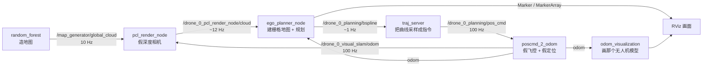
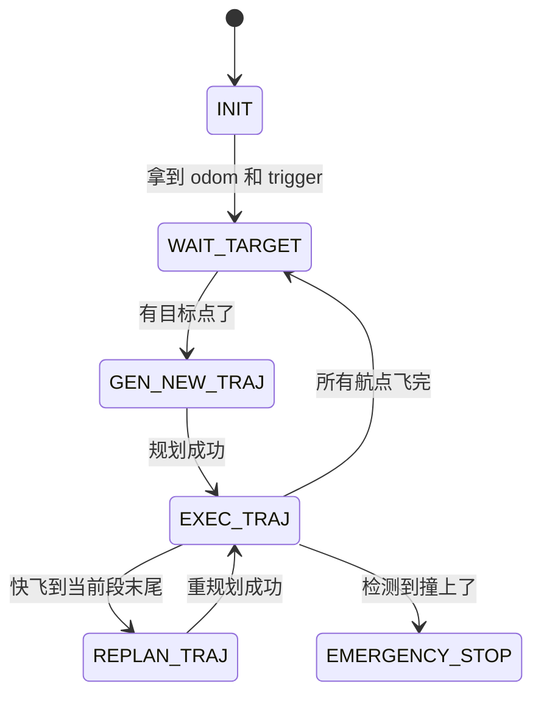

# 第三步：跑通 EGO-Planner 单机仿真

::: tip 这一页你会得到什么
一条能反复执行的启动流程，加上 4 个"看得见"的验收项。做完之后你能回答：无人机为什么会动、谁告诉它往哪飞、怎么证明它真的在规划而不是在播放动画。

前置：已完成 [第一步：搭环境](/getting-started/environment) 和 [第二步：编译工作空间](/ego-planner/build)。
预计时间：第一次 20 分钟，之后 2 分钟。
:::

## 0. 先搞清楚：这个"仿真"到底在仿什么

这是最容易误解的地方，所以放在最前面。

`single_run_in_sim.launch.py` **不是 Gazebo**。它没有物理引擎、没有空气动力学、没有电机模型。它是一套"假的但闭环"的仿真：

| 环节 | 真机上是谁 | 这个仿真里是谁 | 有没有物理 |
| --- | --- | --- | --- |
| 环境地图 | 真实的树林/房间 | `random_forest` 随机生成柱子和圆环 | 无 |
| 深度相机 | RealSense D435 | `pcl_render_node` 按当前位姿从全局点云里"切"出局部点云 | 无 |
| 定位 | VINS-Fusion / 光流 | `poscmd_2_odom` 把位置指令直接当成"已经飞到了" | 无 |
| 飞控 | PX4 | 同上，指令即状态 | 无 |
| 规划器 | `ego_planner_node` | 完全一样，就是真货 | — |

**为什么要这样设计**：先把"规划"这一环单独关起来验证。如果一上来就接 Gazebo + PX4，飞机撞了你根本分不清是规划算错了、控制没跟上、还是定位飘了。先证明大脑是对的，再去接身体。

::: warning 记住这句话
这一步验证的是**大脑**，不是**身体**。所以"飞得很稳"不能说明控制做得好，因为这里根本没有控制。
:::

::: tip 补充：物理引擎其实是可以开的
上面这张表描述的是**默认配置**。`single_run_in_sim.launch.py:37` 有一个 `use_dynamic` 开关，默认 `False`；改成 `True` 就会把"假飞控"换成带动力学的 `so3_quadrotor_simulator` + `so3_control`【源码确认，详见 [第二步第 8 节](/ego-planner/build)】。本页全程用默认值 `False`，因为这一步只想验证规划。
:::

## 1. 数据是怎么流的

只有 6 个节点，跑起来之后它们形成一个闭环：



**闭环的关键那一根线**：`pos_cmd` 回到 `poscmd_2_odom` 变成新的 `odom`，`odom` 又喂回规划器。所以只要 `pos_cmd` 断了，整个循环立刻停住。后面验收频率时，`pos_cmd` 是最重要的一个。

## 2. 启动前的两项检查

不要跳过这一步。跳过之后报的错会难懂十倍。

### 2.1 镜像还在不在

```bash
sudo docker images local/ego-planner-humble:latest
```

期望看到一行结果（有 IMAGE ID 和 SIZE）。如果是空的，回到 [第一步](/getting-started/environment) 重新构建镜像。

### 2.2 编译产物还在不在

```bash
ls /home/yusei/Documents/Codex/ego-humble/install | wc -l
```

期望输出 **20 以上**（20 个包目录 + 若干 colcon 生成的文件）。如果是 0 或很小，回到 [第二步](/ego-planner/build) 重新编译。

::: details 为什么要检查这两样，而不是直接启动？
容器和编译产物是两件独立的事。镜像提供"编译器和 ROS"，`install/` 提供"编译好的 EGO 程序"。镜像在但 `install/` 空 → 报 `Package 'ego_planner' not found`；`install/` 在但镜像没了 → 报 `Unable to find image`。这两个报错长得完全不一样，提前分清能省很多时间。
:::

## 3. 让容器能画到你的屏幕

图形界面（RViz）跑在容器里，但屏幕是宿主机的。X11 默认拒绝"别的用户"连接你的屏幕，而容器里的进程是 root，所以要先放行：

```bash
xhost +si:localuser:root
echo $DISPLAY
```

期望输出：

```
localuser:root being added to access control list
:1
```

- `+si:localuser:root` 的意思是"只允许本机的 root 用户连我的 X 服务器"。
- **不要用 `xhost +`**。那是"允许任何来源"，等于把屏幕对整个网络敞开。
- `$DISPLAY` 的值（这里是 `:1`）后面要传给容器，两边必须一致。

::: warning 这条命令重启后失效
`xhost` 的授权不会保存。每次重启电脑、重新登录桌面之后，启动 RViz 前都要再执行一次。RViz 起不来、报 `cannot connect to X server` 时，先想到这一条。
:::

## 4. 启动仿真（6 个节点）

这是本项目实际使用的命令，一个字都没有简化：

```bash
sudo docker run -d --name ego_sim \
  --network host --ipc host \
  -e DISPLAY=$DISPLAY -e QT_X11_NO_MITSHM=1 \
  -e RMW_IMPLEMENTATION=rmw_cyclonedds_cpp \
  -v /home/yusei/Documents/Codex/ego-humble:/workspace \
  -v /tmp/.X11-unix:/tmp/.X11-unix:rw \
  -w /workspace \
  --log-opt max-size=20m --log-opt max-file=2 \
  local/ego-planner-humble:latest \
  ros2 launch ego_planner single_run_in_sim.launch.py
```

命令很长，但每一段都有必须存在的理由：

| 参数 | 作用 | 去掉会怎样 |
| --- | --- | --- |
| `-d` | 后台运行，终端立刻还给你 | 终端被日志占满，没法再输命令 |
| `--name ego_sim` | 给容器起名，后面所有命令都用这个名字 | 只能用一串随机 ID 来操作 |
| `--network host` | 容器直接用宿主机网络栈 | ROS 2 的 DDS 发现机制跨不过 NAT，RViz 看不到任何话题 |
| `--ipc host` | 共享共享内存 | DDS 的共享内存传输失效，退化成网络回环，白掉性能 |
| `-e DISPLAY=$DISPLAY` | 告诉容器画到哪块屏幕 | 图形程序找不到屏幕 |
| `-e QT_X11_NO_MITSHM=1` | 关掉 Qt 的 X11 共享内存扩展 | RViz 在容器里可能直接崩 |
| `-e RMW_IMPLEMENTATION=...` | 指定用 CycloneDDS 通信中间件 | 和宿主机 ROS 2 的默认中间件不一致时互相看不见 |
| `-v .../ego-humble:/workspace` | 把工作空间挂进容器 | 容器里没有代码，也找不到 `install/` |
| `-v /tmp/.X11-unix:...` | 挂载 X11 的通信套接字 | `$DISPLAY` 设了也连不上屏幕 |
| `--log-opt max-size=20m` | 限制日志文件大小并轮转 | **这是踩过的坑**：日志涨到 690 万行，详见 [运行期问题](/debugging/ego-runtime) |

::: tip 记忆方法
把这串参数分成三组来记：**网络**（`--network host --ipc host`，为了 DDS 能通）、**屏幕**（`DISPLAY` + `.X11-unix` + `QT_X11_NO_MITSHM`，为了能画图）、**磁盘**（`-v /workspace` + `--log-opt`，为了有代码、日志不爆）。三组齐了，容器就能干活。
:::

启动后确认它活着：

```bash
sudo docker ps --format '{{.Names}}: {{.Status}}'
```

期望看到 `ego_sim: Up ...`。如果没有，用 `sudo docker logs --tail 50 ego_sim` 看原因。

::: warning 看日志一定要加 --tail
`sudo docker logs ego_sim`（不加限制）会把从启动到现在的全部日志吐出来。这个仿真每秒打印几十行，跑一小时就是几十万行。养成习惯：**永远写 `--tail 50`**。
:::

## 5. 启动 RViz（看得见的那一半）

RViz 是**单独一个 launch 文件**，`single_run_in_sim.launch.py` 里面没有它【源码确认：该文件内不含任何 rviz 相关内容】。所以要再开一个容器。

先看看你的机器有哪些显卡设备节点：

```bash
ls /dev/dri/
```

本机输出：

```
by-path  card1  card2  renderD128  renderD129
```

然后启动 RViz，把这些设备传进容器：

```bash
sudo docker run -d --name ego_rviz \
  --network host --ipc host \
  -e DISPLAY=$DISPLAY -e QT_X11_NO_MITSHM=1 \
  -e RMW_IMPLEMENTATION=rmw_cyclonedds_cpp \
  -v /home/yusei/Documents/Codex/ego-humble:/workspace \
  -v /tmp/.X11-unix:/tmp/.X11-unix:rw \
  -w /workspace \
  --device /dev/dri/card1 --device /dev/dri/card2 \
  --device /dev/dri/renderD128 --device /dev/dri/renderD129 \
  --log-opt max-size=10m --log-opt max-file=2 \
  local/ego-planner-humble:latest \
  ros2 launch ego_planner rviz.launch.py
```

比上一条只多了 4 个 `--device`。**为什么必须加**：不加的话容器里的 Mesa 打不开显卡，会退回 CPU 软件渲染（`llvmpipe`），点云一多就卡成幻灯片。这是踩过的坑，报错长这样：`MESA: error: Failed to query drm device` / `failed to open /dev/dri/card1`。

验证它真的用上了硬件：

```bash
sudo docker logs --tail 200 ego_rviz | grep -i opengl
```

期望输出（这是本机真实输出）：

```
[rviz2-1] [INFO] [1788495981.976334666] [rviz2]: OpenGl version: 4.6 (GLSL 4.6)
```

::: tip 怎么判断有没有掉进软件渲染
看这一行的版本号。硬件渲染是 `4.6`；如果掉进 `llvmpipe`，这里通常只有 `3.x`，而且日志里会出现 `llvmpipe` 字样。你的设备号可能不是 `card1/card2`，按 `ls /dev/dri/` 的真实结果改。
:::

## 6. 验收项 1：节点齐不齐

```bash
sudo docker exec ego_sim bash -lc \
  'source /opt/ros/humble/setup.bash && source /workspace/install/setup.bash && ros2 node list'
```

真实输出：


::: warning 为什么要写这么长的 source 前缀
`docker exec` **不会执行镜像的 ENTRYPOINT**。而 ROS 环境正是在 ENTRYPOINT 里 source 的。所以直接 `sudo docker exec ego_sim ros2 node list` 会报 `ros2: command not found`。这不是装错了，是环境没加载。以后所有 `docker exec` 跑 ROS 命令，都要带上这段 `bash -lc 'source ... && ...'`。
:::

8 个节点各自是谁：

| 节点 | 它在仿真里扮演 | 对应真机上的什么 |
| --- | --- | --- |
| `/drone_0_ego_planner_node` | 主角：建栅格地图、A\* 搜索、B 样条优化、跑状态机 | 机载电脑上的规划程序 |
| `/drone_0_traj_server` | 把规划出的 B 样条按时间采样成 100 Hz 位置指令 | 轨迹跟踪 / 位置控制的输入端 |
| `/drone_0_poscmd_2_odom` | 假飞控：收到指令就认为"已经飞到"，发出 odom | PX4 + 定位系统 |
| `/drone_0_pcl_render_node` | 假深度相机：按位姿从全局点云切局部点云 | RealSense D435 |
| `/drone_0_odom_visualization` | 画那个无人机模型和历史轨迹 | 地面站显示 |
| `/random_forest` | 造出那片柱子林 | 真实环境本身 |
| `/rviz` | 可视化界面 | 地面站 |
| `/transform_listener_impl_...` | RViz 内部自动创建的 TF 监听器 | 不是你启动的，忽略它 |

只关心 drone_0 的话题时用这个（完整列表有 150 多条，原因见本页第 12 节）：

```bash
sudo docker exec ego_sim bash -lc \
  'source /opt/ros/humble/setup.bash && source /workspace/install/setup.bash && ros2 topic list | grep drone_0'
```


## 7. 验收项 2：频率对不对

节点在不代表数据在流。**最能说明问题的是频率**，因为频率是骗不了人的。

先测那根闭环线：

```bash
sudo docker exec ego_sim bash -lc \
  'source /opt/ros/humble/setup.bash && source /workspace/install/setup.bash && ros2 topic hz /drone_0_planning/pos_cmd'
```

真实输出（按 `Ctrl+C` 停止）：


看三个数：`average rate: 100.002`、`min/max: 0.010s`、`std dev: 0.00007s`。**标准差只有 0.07 毫秒**，说明这是一个非常规整的定时循环，不是"凑巧差不多"。

把 `/drone_0_planning/pos_cmd` 换成下面这些话题，逐个测一遍。这是本机实测值【运行验证】：

| 话题 | 实测频率 | 谁发的 | 频率为什么是这个数 |
| --- | --- | --- | --- |
| `/drone_0_visual_slam/odom` | 99.999 Hz | `poscmd_2_odom` | 源码里写死 `rclcpp::Rate rate(100)`【源码确认】 |
| `/drone_0_planning/pos_cmd` | 100.002 Hz | `traj_server` | 100 Hz 定时器采样 B 样条 |
| `/drone_0_planning/bspline` | 0.98 Hz | `ego_planner_node` | 只在**需要重规划**时才发，所以约 1 Hz |
| `/map_generator/global_cloud` | 10.001 Hz | `random_forest` | 参数 `sensing/rate` 默认 10.0 |
| `/drone_0_pcl_render_node/cloud` | ~12.05 Hz | `pcl_render_node` | 局部点云渲染频率 |
| `/drone_0_grid/grid_map/occupancy_inflate` | ~9.17 Hz | `ego_planner_node` | 收到点云后更新膨胀后的栅格地图 |

::: tip 记忆方法：三档频率
**100 Hz 是"控制档"**（odom、pos_cmd，必须又快又稳）；**10 Hz 左右是"感知档"**（点云、栅格地图，跟着相机走）；**1 Hz 左右是"决策档"**（bspline，想清楚一次就够）。看到一个陌生话题，先猜它属于哪一档，八成能猜对它是干什么的。
:::

::: warning 如果 pos_cmd 是 0 Hz
说明闭环断了。按顺序查：`/drone_0_visual_slam/odom` 有没有？没有 → `poscmd_2_odom` 挂了。有 odom 但没 `bspline` → 规划器没规划出来（见 [运行期问题](/debugging/ego-runtime)）。有 `bspline` 但没 `pos_cmd` → `traj_server` 挂了。**这个顺序就是数据流的顺序**，照着流向查永远不会乱。
:::

## 8. 验收项 3：画面对不对

RViz 窗口应该长这样（本机真实截图，窗口标题是 `default.rviz* - RViz`）：


界面分四块，从左到右：**Displays**（左边那棵树，控制显示什么）、**3D 视图**（中间，主战场）、**Views**（右边，控制摄像机）、**Time**（最下面，时间和帧率）。

只看 3D 视图，飞行中的样子：


能看懂这张图就说明仿真是对的：

- **浅蓝色的柱子和圆环**：`random_forest` 造出来的障碍物，就是要绕开的东西。
- **深蓝色的细线**：无人机已经飞过的历史轨迹。它在柱子之间来回穿了好几趟。
- **中间那团深蓝 + 一小段红线**：无人机当前位置，以及当前正在执行的那一小段轨迹。
- **灰色网格**：地面参考栅格，Fixed Frame 是 `world`。

最下面的 Time 面板：


`ROS Time` 和 `Wall Time` 数值相同，说明用的是真实时钟（没开 `use_sim_time`）。右下角 `29 fps` 说明渲染流畅。

### 那个黄色的 Warn 不是故障

打开 Displays 面板顶部，你一定会看到一个橙色警告：


`Global Status: Warn` → `Fixed Frame` → `No tf data.`

**这是预期行为，不用修**。原因：这套仿真里**所有 TF 广播代码都被上游作者注释掉了**【源码确认】——`local_sensing/src/pcl_render_node.cpp` 里的 TF 广播段是注释状态，`odom_visualization` 的 `tf45` 参数默认 false 而且 `simulator.launch.py` 明确传了 `tf45: False`。

那为什么画面还是正常的？因为各个节点发消息时直接把 `frame_id` 写成了 `world`（例如 `poscmd_2_odom` 源码里写死 `frame_id = "world"`【源码确认】），而 RViz 的 Fixed Frame 也正是 `world`。两边字符串完全相同时不需要坐标变换，RViz 直接就画了。它只是"抱怨"整个系统里一条 TF 都没有。

::: tip 这条经验值钱
所以**不要给这个 demo 硬造一个"TF 树必须完整"的验收项**。判断一个 ROS 项目要不要 TF，看它的发布者写的 `frame_id` 和 RViz 的 Fixed Frame 是否一致，不要凭习惯假设。
:::

## 9. 验收项 4：状态机真的走通了

规划器内部是一个有限状态机（FSM）。它每 10 毫秒执行一次【源码确认：`ego_replan_fsm.cpp:62` 创建了 10 ms 定时器】，并把状态打印出来。

```bash
sudo docker logs --tail 40 ego_sim | grep -E "FSM|plan_success|refine_success"
```

7 个状态，顺序就是源码里 `enum FSM_EXEC_STATE` 的顺序：



本机实际观察到的路径【运行验证】：

```
INIT → WAIT_TARGET → GEN_NEW_TRAJ → EXEC_TRAJ ⇄ REPLAN_TRAJ
```

`EXEC_TRAJ` 和 `REPLAN_TRAJ` 之间来回跳是**正常且必须的**——EGO-Planner 是"局部重规划器"，它只规划前方 `planning_horizon = 7.5` 米【源码确认：launch 里设置】，飞完这一段就必须再规划下一段。它不是一次算完全程。

规划成功时的真实日志：

```
[ego_planner_node-2] [drone 0 replan 188]==============================================
[ego_planner_node-2] iter=12,time(ms)=0.052,rebound.
[ego_planner_node-2] iter(+1)=21,time(ms)=0.060,total_t(ms)=0.512,cost=0.873
[ego_planner_node-2] traj 1 success.
[ego_planner_node-2] plan_success=1
[ego_planner_node-2] refine_success=1
[ego_planner_node-2] [SAFETY]: from EXEC_TRAJ to EXEC_TRAJ
```

怎么读这段：

- `[drone 0 replan 188]`：第 188 次重规划。这个数字一直涨是正常的。
- `rebound`：EGO-Planner 的核心手法。轨迹被障碍物"推开"（rebound = 弹开），靠梯度把控制点推出障碍物。
- `total_t(ms)=0.512`：这一次优化只花了 **0.5 毫秒**。这就是 EGO-Planner 出名的原因——快到可以 100 Hz 级别地反复算。
- `plan_success=1` / `refine_success=1`：`1` 是成功。**看到 `plan_success=0` 就是规划失败**，处理办法见 [运行期问题](/debugging/ego-runtime)。
- `[SAFETY]`：50 ms 的安全检查定时器【源码确认：`ego_replan_fsm.cpp:65`】，`from EXEC_TRAJ to EXEC_TRAJ` 表示检查通过、状态不变。

**四项验收全过，这一步就算完成了。**

## 10. 谁告诉它往哪飞？（我一次都没点鼠标）

第一次跑通时最困惑的问题：我没有在 RViz 里点任何目标点，它自己就飞起来了，为什么？

答案是三个参数配合的结果，全部可以在源码里对上：

**第一，飞行模式是"预设航点"。** launch 里写了 `flight_type: 2`【源码确认：`single_run_in_sim.launch.py:117`】，而枚举定义是【源码确认：`ego_replan_fsm.h:44-49`】：

```cpp
enum TARGET_TYPE { MANUAL_TARGET = 1, PRESET_TARGET = 2, REFENCE_PATH = 3 };
```

**第二，两种模式订阅的话题完全不同，而且互斥**（`if / else if` 两个分支）：

| `flight_type` | 模式 | 订阅的话题 | 源码位置 |
| --- | --- | --- | --- |
| 1 | `MANUAL_TARGET` | `/move_base_simple/goal`（你在 RViz 点的目标点） | `ego_replan_fsm.cpp:115-118` |
| 2 | `PRESET_TARGET` | `/traj_start_trigger`（一个"开始"信号） | `ego_replan_fsm.cpp:125-128` |

因为这里是 `2`，RViz 里点目标点根本没人听——**订阅 `/move_base_simple/goal` 的代码没有被执行**。

**第三，"开始"信号一开机就默认给了。** 这是关键的一行【源码确认：`ego_replan_fsm.cpp:35`】：

```cpp
have_trigger_ = !flag_realworld_experiment_;
```

`fsm/realworld_experiment` 是 false（仿真嘛），所以 `have_trigger_` 一上来就是 `true`。规划器认为"发车信号已经收到了"，于是拿起第一个预设航点直接开飞。

预设航点在 launch 里写死【源码确认：`single_run_in_sim.launch.py:118-137`】：

| 参数 | 值 | 生效吗 |
| --- | --- | --- |
| `point_num` | 4 | — |
| `point0` | (15, 0, 1) | ✅ |
| `point1` | (−15, 0, 1) | ✅ |
| `point2` | (15, 0, 1) | ✅ |
| `point3` | (−15, 0, 1) | ✅ |
| `point4` | (15, 0, 1) | ❌ 被无视 |

`point4` 在 launch 里确实赋了值，但 `point_num = 4` 意味着只读取 `point0`~`point3`【源码确认：`ego_replan_fsm.cpp:40` 的循环是 `for (int i = 0; i < waypoint_num_; i++)`】。所以它是一行**无效配置**，不是第 5 个航点。

所以飞行计划就是：从 x=−15 出发，飞到 +15，回到 −15，再到 +15，再回 −15。**在 30 米长的柱子林里来回穿 4 趟**。这解释了你在 3D 视图里看到的那几条重叠的历史轨迹。

起飞点也是写死的：`init_x_ = -15.0`、`init_y_ = 0.0`、`init_z_ = 0.1`【源码确认：`single_run_in_sim.launch.py:165-167`】。

## 11. 飞完之后停在 WAIT_TARGET，这不是卡死

跑一段时间后，你会发现日志里只剩下同一行在刷：

```
[ego_planner_node-2] [FSM]: state: WAIT_TARGET
[ego_planner_node-2] [FSM]: state: WAIT_TARGET
```

而 RViz 里无人机停着不动了。**这是正常结束，不是故障。** 源码里的逻辑是这样的【源码确认：`ego_replan_fsm.cpp:583-596`】：

```cpp
have_target_ = false;
have_trigger_ = false;          // ← 关键：把"发车信号"清掉了
if (target_type_ == TARGET_TYPE::PRESET_TARGET) {
  wp_id_ = 0;                   // 航点索引归零
  planNextWaypoint(wps_[wp_id_]);
}
changeFSMExecState(WAIT_TARGET, "FSM");
```

四趟航点飞完后，它把 `have_trigger_` 置成 `false` 并回到 `WAIT_TARGET`。而 `WAIT_TARGET` 状态里第一句就是"没有 trigger 就直接返回"【源码确认：`ego_replan_fsm.cpp:494`】。于是它开始等一个 `/traj_start_trigger` 消息——**但预设模式下没有任何节点会发这个消息**，可以自己验证：

```bash
sudo docker exec ego_sim bash -lc \
  'source /opt/ros/humble/setup.bash && source /workspace/install/setup.bash && ros2 topic info /traj_start_trigger'
```

真实输出：

```
Type: geometry_msgs/msg/PoseStamped
Publisher count: 0
Subscription count: 1
```

`Publisher count: 0` —— 只有规划器在听，没人会说。所以它会一直等下去。

### 让它再飞一趟（已验证可行）

既然它在等一条消息，那我们手动发一条就行：

```bash
sudo docker exec ego_sim bash -lc \
  'source /opt/ros/humble/setup.bash && source /workspace/install/setup.bash && \
   ros2 topic pub --once /traj_start_trigger geometry_msgs/msg/PoseStamped "{header: {frame_id: \"world\"}}"'
```

**消息内容完全不重要**，随便填。因为回调函数把参数 `msg` 收下之后一个字段都没用【源码确认：`ego_replan_fsm.cpp:228-233`】：

```cpp
void EGOReplanFSM::triggerCallback(const ...PoseStamped> &msg) {
  have_trigger_ = true;      // 只干这一件事
  cout << "Triggered!" << endl;
  init_pt_ = odom_pos_;      // 把起点更新成"当前位置"
}
```

发完之后立刻看日志【运行验证：本项目实测确实重新起飞】：

```
[ego_planner_node-2] [drone 0 replan 188]===================================
[ego_planner_node-2] traj 1 success.
[ego_planner_node-2] plan_success=1
[ego_planner_node-2] refine_success=1
[ego_planner_node-2] [SAFETY]: from EXEC_TRAJ to EXEC_TRAJ
```

::: tip 这是你的第一个"能自己改"的抓手
你现在已经能用一条命令控制这架无人机的行为了。顺着这个思路往下想：把 `flight_type` 改成 `1`，就能改成用 RViz 的 **2D Goal Pose** 按钮手点目标点（工具栏在这里）——


不过要注意 `2D Goal Pose` 默认发的是 `/goal_pose`，而 EGO 订阅的是 `/move_base_simple/goal`，两者名字不一样，需要改 RViz 的工具配置或加一个重映射。【待验证：本项目还没实测过这条路径】
:::

## 12. 为什么话题列表里有 21 架无人机？

`ros2 topic list` 完整输出有 **150 多条**，里面全是 `/drone_1_...`、`/drone_7_...` 一直到 `/drone_20_...`。第一次看到会以为自己启动错了。

**其实一架都没有。** 这些话题是 **RViz 订阅出来的**。

关键知识点：`ros2 topic list` 列出的是"ROS 图里存在的话题"，而**只要有订阅者，话题就会出现，哪怕没有任何人发布**。RViz 的配置文件 `default.rviz` 里预置了 drone0 到 drone20 共 21 组显示项（上游为了支持集群仿真），RViz 一启动就把这 21 组全订阅了。

自己验证一下：

```bash
sudo docker exec ego_sim bash -lc \
  'source /opt/ros/humble/setup.bash && source /workspace/install/setup.bash && ros2 topic info /drone_1_vis/robot'
```

真实输出：

```
Type: visualization_msgs/msg/Marker
Publisher count: 0
Subscription count: 1
```

`Publisher count: 0`，坐实了——没人发，只有 RViz 在听。

::: tip 顺手抓到的两个上游 bug
数话题的时候会发现 `/drone_5_grid/grid_map/occupancy_inflate` 不见了，而 1~20 号里其他每一个都有。原因是 `default.rviz` 里 drone5 那一组的地图话题被写成了 `/drone_2_grid/grid_map/occupancy_inflate`【源码确认：`default.rviz:1144`】——复制粘贴时漏改了编号。运行时的话题列表刚好证实了这一点【运行验证】。

同类问题还有一处：drone7 的深度图显示项指向 `/drone_2_pcl_render_node/depth`【源码确认：`default.rviz:1517`】。这个在运行时看不出来，因为所有深度图显示项的 `Enabled` 都是 `false`（没启用就不会订阅）。

**这两个 bug 不影响单机仿真**，不用去改第三方配置。但它说明一件事：开源项目里的配置文件也会有手误，看到"少了一个话题"先怀疑配置，别怀疑自己。
:::

## 13. 停下来和清理

```bash
sudo docker stop ego_sim ego_rviz     # 停止（容器还留着）
sudo docker rm   ego_sim ego_rviz     # 删除容器（下次要重新 docker run）
```

| 操作 | 会丢什么 | 不会丢什么 |
| --- | --- | --- |
| `docker stop` | 只是进程停了 | 容器、镜像、`install/` 都在，可以 `docker start` 再起 |
| `docker rm` | 容器本身（以及容器里临时装的东西） | **镜像和 `install/` 编译产物都不受影响** |

因为工作空间是 `-v` 挂载进去的，代码和编译结果一直存在宿主机上，删容器不会丢。这也是为什么删容器很安全、可以放心重来。

::: warning 重启电脑之后
容器不会自动起来，`xhost` 授权也会失效。完整顺序是：`xhost +si:localuser:root` → 启动 `ego_sim` → 启动 `ego_rviz`。
:::

## 记忆卡

**卡 1：这套仿真**

- 一句话理解：一个没有物理引擎、但数据闭环的"规划器试验台"。
- 三个关键词：假定位、假相机、真规划。
- 输入：预设航点（launch 写死）+ 随机森林地图。
- 处理：栅格地图 → A\* 找路 → B 样条优化（rebound 弹开障碍）→ 采样成指令。
- 输出：100 Hz 的 `pos_cmd`，喂回假飞控变成新的 odom。

**卡 2：EGO-Planner 的性格**

- 一句话理解：只看前方 7.5 米，飞一段算一段的局部重规划器。
- 三个关键词：局部、重规划、亚毫秒。
- 输入：当前 odom + 局部点云 + 目标点。
- 处理：把撞到障碍的控制点用梯度"弹"出来。
- 输出：一条 B 样条曲线（`bspline` 话题，约 1 Hz 发一条）。

## 自测题

**1. 我在 RViz 里点了 2D Goal Pose，无人机没反应。为什么？**

::: details 答案
因为 `flight_type = 2`（PRESET_TARGET），订阅 `/move_base_simple/goal` 的那段代码在 `else if` 的另一个分支里，根本没被执行。另外 RViz 的按钮默认发的是 `/goal_pose`，和 EGO 期望的话题名也不一样。

:::

**2. `pos_cmd` 掉到 0 Hz 了，我应该先查什么？**

::: details 答案
按数据流顺序往上查：先看 `/drone_0_visual_slam/odom`（没有 → 假飞控挂了），再看 `/drone_0_planning/bspline`（没有 → 规划器没规划出来），最后才怀疑 `traj_server`。永远顺着数据流查。

:::

**3. RViz 报 `No tf data`，需要修吗？**

::: details 答案
不需要。这套仿真里所有 TF 广播代码都被上游注释掉了（`pcl_render_node.cpp:145,161`），各节点直接把 `frame_id` 写成 `world`，和 RViz 的 Fixed Frame 一致，所以不需要坐标变换就能画。

:::

**4. 日志里刷 `WAIT_TARGET`，无人机不动了，是不是崩了？**

::: details 答案
不是。四个预设航点飞完后源码会把 `have_trigger_` 清零并回到 `WAIT_TARGET`（`ego_replan_fsm.cpp:583-596`），而预设模式下没人发 `/traj_start_trigger`（`Publisher count: 0`），所以它会一直等。手动 `ros2 topic pub --once /traj_start_trigger ...` 就能让它再飞一趟。

:::

**5. 为什么 `docker exec` 里跑 `ros2` 会报 command not found？**

::: details 答案
`docker exec` 不执行镜像的 ENTRYPOINT，而 ROS 环境是在 ENTRYPOINT 里 source 的。必须自己带上 `bash -lc 'source /opt/ros/humble/setup.bash && source /workspace/install/setup.bash && ...'`。

:::
