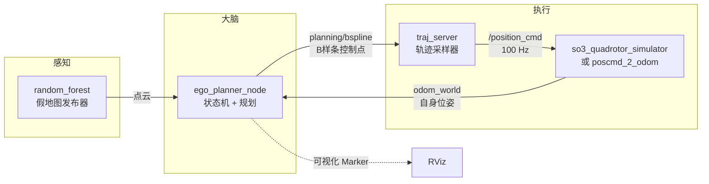
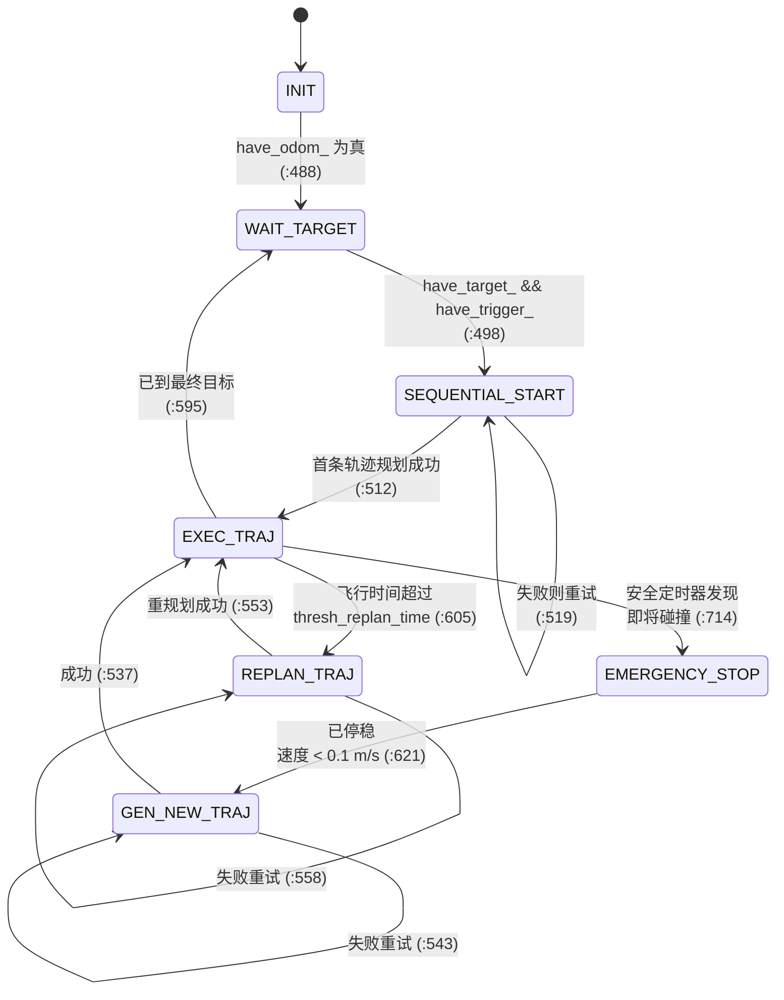

# 第四步：读懂 EGO-Planner 源码

::: tip 这一页解决什么问题
仿真跑通之后，屏幕上有一条绿色轨迹在动，但你不知道那条线是谁算出来的、算错了该去哪里看。这一页把 6390 行 C++ 拆成一条**从外到内、每层都能停下来验证**的阅读路线，让你最后能自己改一行代码并看到效果。

本页所有行号都来自实际源码，标了【源码确认】的都可以用 `sed -n 'N p' 文件` 复现。
:::

## 0. 为什么要按这个顺序读

新手读大型 C++ 项目最常见的死法是「从 `main` 开始一路 F12 跳定义」，跳三层就迷路了。原因是你在没有地图的情况下钻进了细节。

正确顺序是**先建立地图，再钻细节**：

```
全局架构 → 目录 → 入口 → 初始化 → 数据结构 → 主循环 → 调用关系 → 数据流 → 关键算法 → 小修改
```

**怎么记**：像认识一座城市。先看卫星图（架构），再看街区划分（目录），再找大门（入口），进门看布局（初始化），然后跟着人流走（主循环、数据流），最后才研究某个车间里的机床（算法）。

代码量先摆在这里，你就知道哪些必须精读、哪些先跳过。【运行验证】用 `grep -c ''` 统计：

| 文件 | 行数 | 优先级 | 说明 |
| --- | --- | --- | --- |
| `plan_manage/src/ego_planner_node.cpp` | 56（有效 22） | **A** | 入口，必须逐行读 |
| `plan_manage/src/ego_replan_fsm.cpp` | 980 | **A** | 状态机，项目的大脑 |
| `plan_manage/src/planner_manager.cpp` | 581 | **A** | 规划三步流水线 |
| `plan_manage/src/traj_server.cpp` | 275 | **B** | 轨迹 → 控制指令 |
| `bspline_opt/src/uniform_bspline.cpp` | 377 | **B** | B 样条数学 |
| `path_searching/src/dyn_a_star.cpp` | 261 | **B** | A* 搜索 |
| `plan_env/src/grid_map.cpp` | 1078 | **C** | 栅格地图与 ESDF |
| `bspline_opt/src/bspline_optimizer.cpp` | 1862 | **C** | 优化器核心数学 |

优先级的含义：**A = 现在必须读懂**（不读懂就无法定位任何问题）；**B = 想改行为时再读**；**C = 想改算法时再读，需要先补数学**。

::: warning 不要一开始就读 bspline_optimizer.cpp
它是最大的文件（1862 行），也是论文的核心创新点，但它是纯数学优化，没有地图就读它等于自虐。先把 A 类三个文件读完，你会自然知道它的输入输出是什么，那时再读会容易十倍。
:::

## 1. 第一层：全局架构（三个角色）

仿真跑起来是 8 个节点，但真正决定飞行的只有三个角色。先记住这三个，其余都是配角：



这张图就是**整个项目的骨架**，后面所有代码都挂在这四条箭头上。

【源码确认】四条箭头对应的话题名，可以在源码里一一找到：

| 箭头 | 话题 | 消息类型 | 源码位置 |
| --- | --- | --- | --- |
| 自身位姿进大脑 | `odom_world` | `nav_msgs/Odometry` | `ego_replan_fsm.cpp:68` 订阅，话题名字符串在 `:69` |
| 大脑输出轨迹 | `planning/bspline` | `traj_utils/Bspline` | `ego_replan_fsm.cpp:112` 发布 |
| 轨迹进执行器 | `planning/bspline` | 同上 | `traj_server.cpp:239` 订阅 |
| 执行器输出指令 | `/position_cmd` | `quadrotor_msgs/PositionCommand` | `traj_server.cpp:244` 发布，队列深度 50 |

::: tip 为什么大脑不直接发控制指令
`planning/bspline` 里装的是**一条曲线的控制点**，不是「现在飞到哪」。曲线大约每 10~100 ms 才重算一次，而控制器需要 100 Hz 的位置指令。`traj_server` 的唯一工作就是**把曲线按时间采样成高频指令**（`traj_server.cpp:248` 的 10 ms 定时器）。

这是一个非常通用的机器人架构模式：**慢速规划 + 快速插值**。记住它，PX4、MoveIt、Nav2 都是这个结构。
:::

## 2. 第二层：目录地图

源码根在 `~/Documents/Codex/ego-humble/src/ego-planner-swarm/src/`，下面只有两个目录，这个划分本身就是重要信息：

```
src/
├── planner/         ← 真正的算法（你要读的）
└── uav_simulator/   ← 假的传感器和假的飞机（只为让算法有输入输出）
```

**为什么要先分清这两个**：`uav_simulator` 里的代码将来接真机时**会被整体替换掉**。花时间精读它是浪费。你要读的是 `planner/`。

【运行验证】各包代码量（`.cpp`/`.h`/`.hpp` 行数合计）与阅读优先级：

| 包 | 行数 | 优先级 | 一句话职责 |
| --- | --- | --- | --- |
| `planner/plan_manage` | 2119 | **A** | 入口、状态机、规划流水线调度 |
| `planner/path_searching` | 375 | **B** | A* 前端搜索，给优化器一条初始路径 |
| `planner/bspline_opt` | 4129 | **C** | B 样条轨迹优化，论文核心 |
| `planner/plan_env` | 2935 | **C** | 栅格地图、距离场，碰撞查询的底座 |
| `planner/traj_utils` | 1111 | **B** | 自定义消息定义 + RViz 可视化 |
| `planner/rosmsg_tcp_bridge` | 867 | 跳过 | 多机通信桥，单机用不到 |
| `planner/drone_detect` | 660 | 跳过 | 多机互相识别，单机用不到 |
| `uav_simulator/so3_quadrotor_simulator` | 32418 | 跳过 | 含内置 ODE 物理库，行数虚高 |
| `uav_simulator/fake_drone` | 124 | **B** | 最小假飞机，只有 124 行，值得一读 |
| 其余 `uav_simulator/*` | — | 跳过 | 假传感器/假地图 |

::: tip 先读 fake_drone（124 行）
`uav_simulator/fake_drone` 编译出的节点叫 `poscmd_2_odom`（【源码确认】包名在 `fake_drone/package.xml` 的 `<name>` 里，不是目录名）。它做的事只有一件：**收到位置指令就假装自己已经到了那里**，直接把指令回写成 odom。

124 行，没有物理，没有数学。读它能在最短时间内让你看懂「一个 ROS 2 节点是怎么收发消息的」，是整个仓库最好的入门读物。默认配置就是用它（`use_dynamic=False`），所以你现在跑的仿真里飞机确实是「假」的 —— 详见[仿真页](/ego-planner/simulation)。
:::

## 3. 第三层：入口只有 22 行

先看它。这是整个大脑的 `main`：

```bash
sed -n '1,22p' ~/Documents/Codex/ego-humble/src/ego-planner-swarm/src/planner/plan_manage/src/ego_planner_node.cpp
```

【源码确认】`ego_planner_node.cpp:1-22` 全文：

```cpp
#include <rclcpp/rclcpp.hpp>
#include <visualization_msgs/msg/marker.hpp>
#include <iostream>

#include <ego_planner/ego_replan_fsm.h>

using namespace ego_planner;

int main(int argc, char **argv)
{
  rclcpp::init(argc, argv);
  auto node = std::make_shared<rclcpp::Node>("ego_planner_node");

  EGOReplanFSM rebo_replan;

  rebo_replan.init(node);

  rclcpp::spin(node);
  rclcpp::shutdown();

  return 0;
}
```

逐行读：

| 行 | 代码 | 干什么 | 为什么需要 |
| --- | --- | --- | --- |
| 11 | `rclcpp::init` | 初始化 ROS 2 客户端库 | 解析命令行里的 `--ros-args`、连上 DDS。不调用它，后面任何 ROS 调用都崩 |
| 12 | `make_shared<rclcpp::Node>("ego_planner_node")` | 创建节点对象 | 节点名就是你 `ros2 node list` 看到的那个。用 `shared_ptr` 是因为回调要共享它 |
| 14 | `EGOReplanFSM rebo_replan;` | 在栈上造出状态机 | **所有真正的逻辑都在这个对象里**，`main` 只是把它抱起来 |
| 16 | `rebo_replan.init(node)` | 把节点交给状态机 | 状态机在这里读参数、建订阅/发布、开定时器。**下一层就从这里进去** |
| 18 | `rclcpp::spin(node)` | 交出控制权 | 阻塞在这里，反复检查有没有消息或定时器到期，有就调回调。**程序此后不再走直线** |
| 19 | `rclcpp::shutdown()` | 收尾 | Ctrl-C 让 `spin` 返回后清理 DDS 资源 |

::: tip 记忆卡：ROS 2 节点的四步骨架
**一句话理解**：`init` 开机 → 造节点 → 注册回调 → `spin` 交出控制权。

**三个关键词**：init / node / spin

**你写任何 ROS 2 C++ 节点都是这四步**，区别只在第三步注册了什么。看到 `spin` 就知道「主动执行结束，被动响应开始」。
:::

### 3.1 白送的 ROS 1 → ROS 2 对照教材

这个文件第 24 行往后，**原作者把整份 ROS 1 版本注释掉留在了原地**（【源码确认】`ego_planner_node.cpp:24-56`）。这对你是运气：同一份逻辑的两种写法并排放着。

```bash
sed -n '24,56p' ~/Documents/Codex/ego-humble/src/ego-planner-swarm/src/planner/plan_manage/src/ego_planner_node.cpp
```

| 事情 | ROS 1（注释里） | ROS 2（在用的） |
| --- | --- | --- |
| 头文件 | `#include <ros/ros.h>` | `#include <rclcpp/rclcpp.hpp>` |
| 初始化 | `ros::init(argc, argv, "ego_planner_node", ...)` | `rclcpp::init(argc, argv)` + 单独造 Node |
| 节点句柄 | `ros::NodeHandle nh("~")` | `std::make_shared<rclcpp::Node>("名字")` |
| 消息头文件 | `visualization_msgs/Marker.h` | `visualization_msgs/msg/marker.hpp` |
| 多线程 | `ros::AsyncSpinner async_spinner(4)` | `rclcpp::spin`（单线程）或 `MultiThreadedExecutor` |
| Ctrl-C | 自己 `signal(SIGINT, ...)` + `NoSigintHandler` | `rclcpp` 默认处理，不用自己写 |

::: warning 这里有一个必须记住的坑
ROS 1 的 `NodeHandle nh("~")` 里那个 `~` 表示「私有命名空间」，参数和话题会自动挂在节点名下面。**ROS 2 没有这个概念**，节点名和参数是分开管理的。

这正是这个移植版最容易出问题的地方 —— 参数不会自动挂进来，而且 **ROS 2 对没有 `declare_parameter` 声明过的参数会静默忽略**。我们在地图复现性问题上真实踩过这个坑，完整过程见[运行期排错](/debugging/ego-runtime)。

**怎么记**：ROS 1 的 `~` 是「魔法自动挂载」，ROS 2 取消了魔法，改成「必须先申报才能收」。
:::

## 4. 第四层：初始化做了什么

`main` 第 16 行的 `init(node)` 进到 `ego_replan_fsm.cpp:7`。这个函数 150 行，但结构极其规整，分成四段：

```bash
sed -n '7,156p' ~/Documents/Codex/ego-humble/src/ego-planner-swarm/src/planner/plan_manage/src/ego_replan_fsm.cpp
```

| 段 | 行号 | 做什么 |
| --- | --- | --- |
| ① 置初始状态 | `:11-15` | `exec_state_ = INIT`、`have_target_ = false`、`have_odom_ = false` |
| ② 申报并读参数 | `:17-49` | 先 `declare_parameter` 再 `get_parameter`，成对出现 |
| ③ 造子模块 | `:52-59` | 可视化、`EGOPlannerManager`（规划流水线的持有者） |
| ④ 注册回调 | `:62-155` | 2 个定时器 + 5 个订阅 + 4 个发布 |

### 4.1 参数为什么必须成对出现

【源码确认】`:17-33` 是完美的教科书写法 —— 8 个 `declare_parameter` 紧跟 8 个 `get_parameter`：

```cpp
node_->declare_parameter("fsm/planning_horizon", -1.0);
// ...
node_->get_parameter("fsm/planning_horizon", planning_horizen_);
```

注意默认值故意写成 `-1`、`-1.0` 这种**不可能是合法配置**的值。这是一个好习惯：如果 launch 忘了传，参数会变成 `-1`，行为立刻异常，你马上发现；如果默认值写成看似合理的 `7.5`，配置丢了你根本察觉不到。

**怎么记**：`declare` 是「申报这个参数存在」，`get` 是「取它的值」。**只 `get` 不 `declare` 会抛异常；launch 传了但没 `declare` 会被静默丢弃**。后者才是真正的杀手，因为它不报错。

### 4.2 两个定时器就是程序的心跳

【源码确认】`:62` 和 `:65`：

| 定时器 | 周期 | 回调 | 职责 |
| --- | --- | --- | --- |
| `exec_timer_` | **10 ms（100 Hz）** | `execFSMCallback` → `:464` | 状态机主循环，决定「现在该干什么」 |
| `safety_timer_` | **50 ms（20 Hz）** | `checkCollisionCallback` → `:699` | 检查当前轨迹会不会撞上新出现的障碍 |

::: tip 为什么安全检查要独立成一个定时器
如果把碰撞检查写在主循环里，那么主循环一旦卡在某个耗时的重规划上，安全检查也一起卡住 —— 而这正是最需要它的时候。拆成两个定时器，安全检查就有了独立的执行机会。

**这是所有实时系统的通用设计：安全通道必须独立于业务通道。**（【推测】ROS 2 默认单线程 executor 下两者仍会互相排队，真正的隔离需要 `MultiThreadedExecutor` + 回调组；这一点我没有在本项目中实测，标为待验证。）
:::

### 4.3 五个订阅、四个发布

【源码确认】把 `:68-155` 的收发整理成一张表，这张表就是你调试时的「接线图」：

| 方向 | 话题 | 行号 | 单机仿真里用到吗 |
| --- | --- | --- | --- |
| 订阅 | `odom_world` | `:68` | ✅ 自身位姿，最关键的输入 |
| 订阅 | `/move_base_simple/goal` | `:117` | ✅ RViz 里点 2D Nav Goal 就是发这个 |
| 订阅 | `/traj_start_trigger` | `:127` | ⬜ 真机实验用 |
| 订阅 | `planning/broadcast_bspline_to_planner` | `:104` | ⬜ 多机 |
| 订阅 | `/drone_N_planning/swarm_trajs` | `:80` | ⬜ 多机 |
| 发布 | `planning/bspline` | `:112` | ✅ 唯一真正的输出 |
| 发布 | `planning/data_display` | `:113` | ✅ 调试数据 |
| 发布 | `planning/broadcast_bspline_from_planner` | `:103` | ⬜ 多机 |
| 发布 | `/drone_N_planning/swarm_trajs` | `:101` | ⬜ 多机 |

::: warning 一半的接口是多机用的
这个仓库叫 `ego-planner-swarm`，多机是它的主要卖点。单机跑的时候有 4 个话题是空转的。

**排错含义**：`ros2 topic list` 里看到 `swarm_trajs` 之类的话题**存在但没有数据**是完全正常的。光有订阅者也会让话题出现在列表里 —— 别把它当故障追。这个坑我们真实踩过，记在[运行期排错](/debugging/ego-runtime)。
:::

## 5. 第五层：主循环就是一台状态机

`execFSMCallback`（`ego_replan_fsm.cpp:464`）每 10 ms 执行一次，是**整个项目最该精读的 176 行**。它的结构是一个 `switch (exec_state_)`。

【源码确认】七个状态定义在头文件 `include/ego_planner/ego_replan_fsm.h:34-43`：

```cpp
enum FSM_EXEC_STATE
{
  INIT, WAIT_TARGET, GEN_NEW_TRAJ, REPLAN_TRAJ,
  EXEC_TRAJ, EMERGENCY_STOP, SEQUENTIAL_START
};
```



### 5.1 迁移条件逐条对照

把图翻译成表，调试时对着这张表看日志：

| 从 | 到 | 条件 | 行号 |
| --- | --- | --- | --- |
| `INIT` | `WAIT_TARGET` | 收到过 odom | `:484-488` |
| `WAIT_TARGET` | `SEQUENTIAL_START` | 有目标**且**有触发 | `:494-498` |
| `SEQUENTIAL_START` | `EXEC_TRAJ` | `planFromGlobalTraj(10)` 成功（最多试 10 次） | `:509-512` |
| `GEN_NEW_TRAJ` | `EXEC_TRAJ` | 同上，并置 `flag_escape_emergency_` | `:534-539` |
| `EXEC_TRAJ` | 切下一航点 | 距当前目标 < `no_replan_thresh_` 且还有航点 | `:575-580` |
| `EXEC_TRAJ` | `WAIT_TARGET` | 轨迹时间走完且已是最终目标 | `:584-595` |
| `EXEC_TRAJ` | `REPLAN_TRAJ` | 已飞行时间 > `thresh_replan_time` | `:603-605` |
| `EXEC_TRAJ` | `EMERGENCY_STOP` | 安全定时器判定会撞 | `:714` |
| `EMERGENCY_STOP` | `GEN_NEW_TRAJ` | `fail_safe` 开启且速度 < 0.1 m/s | `:620-621` |

::: tip 这解释了你看到的「仿真停在 WAIT_TARGET」
【运行验证】我们的仿真飞完 4 个预设航点后停在 `WAIT_TARGET` 不动，一开始以为是故障。看 `:584-595` 就明白了：到达最终目标时代码把 `have_target_ = false; have_trigger_ = false` 都清掉，然后回到 `WAIT_TARGET`。而 `WAIT_TARGET` 的出口条件（`:494`）要求两者同时为真。

所以**这不是卡死，是设计上的"任务完成，等新指令"**。在 RViz 里点一个 2D Nav Goal（发到 `/move_base_simple/goal`，`:117` 订阅）就会重新起飞。

**怎么记**：状态机停住时不要先怀疑死锁，先去找**出口条件里哪个布尔量是 false**。
:::

### 5.2 一个容易看漏的 ROS 2 移植细节

【源码确认】函数**第一行**是 `exec_timer_->cancel(); // To avoid blockage`（`:466`），**最后**在 `:634-637` 又 `reset()` 回来：

```cpp
// :466
exec_timer_->cancel(); // To avoid blockage
// ...
// :633   // exec_timer_.start();      ← ROS 1 的写法，被注释掉了
if (exec_timer_ && exec_timer_->is_canceled())
{
  exec_timer_->reset();
}
```

这是一个**防重入锁**：规划一次可能耗时几十毫秒，而定时器周期只有 10 ms。如果不先 `cancel`，回调还没返回下一次就排上了队，状态机会被自己的积压压垮。

注意 `:633` 那行注释掉的 `// exec_timer_.start();` —— ROS 1 的 `Timer` 有 `start()/stop()`，ROS 2 的 `TimerBase` 改成了 `reset()/cancel()`，且需要先用 `is_canceled()` 判断。又是一处现成的移植对照。

::: warning 别学这里的 goto
这段代码用 `goto force_return;` 跳到函数末尾（`:486`、`:495`、`:596` 跳到 `:632`）。它在这里是**为了保证无论从哪条分支退出，末尾的 `exec_timer_->reset()` 都会执行** —— 相当于手写的 `finally`。

能理解它为什么在这里出现就够了，自己写新代码请用 RAII 或提取函数，不要模仿 `goto`。
:::

## 6. 第六层：规划流水线的三步

状态机只负责「什么时候规划」，**「怎么规划」全在 `planner_manager.cpp:48` 的 `reboundReplan`**。这个函数 300 行，但作者用注释把它切成了清清楚楚的三段：

| 步 | 注释所在行 | 干什么 | 输出 |
| --- | --- | --- | --- |
| **STEP 1: INIT** | `:67` | 生成一条**初始轨迹**（多项式或沿用上一条），采样成点集 | 控制点 `ctrl_pts`（`:221` `parameterizeToBspline`） |
| **STEP 2: OPTIMIZE** | `:230` | 把控制点推离障碍、拉平曲率 | 优化后的控制点（`:276` `BsplineOptimizeTrajRebound`） |
| **STEP 3: REFINE** | `:295` | 若速度/加速度超限，**重新分配时间**再优化一次 | 最终轨迹（`:307` `refineTrajAlgo`） |

::: tip 记忆卡：EGO 规划三步
**一句话理解**：先胡乱画一条线（INIT），再把线推开躲障碍（OPTIMIZE），最后调整快慢让飞机跟得上（REFINE）。

**三个关键词**：初始化 / 优化 / 重分配时间

**输入**：起点位姿速度加速度 + 局部目标点 + 栅格地图
**处理**：多项式初值 → B 样条控制点 → 梯度优化 → 时间重分配
**输出**：一条 B 样条曲线的控制点，经 `planning/bspline` 发出

**为什么要分三步**：直接优化一条随机曲线不收敛，所以要一个「大致对」的初值；而优化只管形状不管时间，所以还要第三步单独修时间。**形状和时间分开处理，是轨迹优化的通用套路。**
:::

### 6.1 一个写死的数字，害我们排了很久的错

【源码确认】`planner_manager.cpp:43`（在 `initPlanModules` 里）：

```cpp
bspline_optimizer_->a_star_->initGridMap(grid_map_, Eigen::Vector3i(100, 100, 100));
```

A* 的节点池被**硬编码**成 100×100×100。栅格分辨率 0.1 m，也就是说 **A* 只能在一个 10 m 的立方体内搜索**。而 `fsm/planning_horizon` 配的是 7.5 m。

超出这个盒子时，`path_searching/include/path_searching/dyn_a_star.h:107` 会刷屏：

```
Ran out of pool, index=... POOL_SIZE=100 100 100
```

我们真实遇到过并定位到了这两行，完整过程和结论在[运行期排错](/debugging/ego-runtime)。

**怎么记**：看到 `Ran out of pool` 不要去查地图或参数，直接想「A* 的盒子装不下了」，然后去 `planner_manager.cpp:43` 看盒子多大。

### 6.2 这个 ROS 2 分支自带中文注释

【源码确认】比如 `planner_manager.cpp:68` 和 `:80`：

```cpp
/*** STEP 1: INIT
根据起始点和目标点的距离计算首个时间步长ts,向量的模大于0.1则用1.5倍否则用5倍
***/
```

移植者在关键处补了中文注释。读到看不懂的地方**先在附近搜中文** —— 这是这个分支相比上游 ROS 1 版本的额外福利：

```bash
grep -rn --include=*.cpp --include=*.h -P '[\x{4e00}-\x{9fa5}]' \
  ~/Documents/Codex/ego-humble/src/ego-planner-swarm/src/planner | wc -l
```

【运行验证】输出 `164` —— `planner/` 下有 164 行带中文的注释可以蹭。

## 7. 速查表：函数行号地图

读源码时最费时间的不是理解，是**找**。把 A 类两个文件的函数位置抄下来贴在手边，可以省掉大量翻页。

【源码确认】`plan_manage/src/ego_replan_fsm.cpp`（980 行）：

| 行 | 函数 | 什么时候被调用 |
| --- | --- | --- |
| 7 | `init` | 启动时一次 |
| 157 | `readGivenWps` | 读 launch 里的预设航点 |
| 186 | `planNextWaypoint` | 切换到下一个航点 |
| 228 | `triggerCallback` | 收到 `/traj_start_trigger` |
| 235 | `waypointCallback` | **RViz 点 2D Nav Goal 时** |
| 249 | `odometryCallback` | 每次收到 odom（最高频） |
| 269 | `BroadcastBsplineCallback` | 多机 |
| 355 | `swarmTrajsCallback` | 多机 |
| 438 | `changeFSMExecState` | 每次状态迁移，**打断点的最佳位置** |
| 457 | `printFSMExecState` | 每 100 次循环打一次状态 |
| **464** | **`execFSMCallback`** | **每 10 ms，主循环** |
| 641 | `planFromGlobalTraj` | 从全局轨迹起规划 |
| 663 | `planFromCurrentTraj` | 从当前轨迹起规划（重规划） |
| 699 | `checkCollisionCallback` | 每 50 ms，安全检查 |
| 783 | `callReboundReplan` | **通往 `planner_manager` 的门** |
| 835 | `publishSwarmTrajs` | 多机 |
| 887 | `callEmergencyStop` | 紧急停止 |
| 923 | `getLocalTarget` | 在 `planning_horizon` 内截出局部目标 |

【源码确认】`plan_manage/src/planner_manager.cpp`（581 行）：

| 行 | 函数 | 职责 |
| --- | --- | --- |
| 13 | `initPlanModules` | 建地图、优化器、A*（含 `:43` 的 100³ 节点池） |
| **48** | **`reboundReplan`** | **规划主流程，三步流水线** |
| 350 | `EmergencyStop` | 生成一条原地刹停轨迹 |
| 363 | `checkCollision` | 碰撞检查 |
| 388 | `planGlobalTrajWaypoints` | 多航点全局轨迹 |
| 463 | `planGlobalTraj` | 单目标全局轨迹 |
| 530 | `refineTrajAlgo` | STEP 3 的时间重分配 |
| 551 | `updateTrajInfo` | 更新轨迹时间戳等元信息 |
| 562 | `reparamBspline` | B 样条重参数化 |

::: tip 只需要记住两个入口
**`execFSMCallback:464`（何时规划） + `reboundReplan:48`（如何规划）**。其余函数都能从这两个顺着调用链找到。

调试时的第一个断点永远打在 `changeFSMExecState:438` —— 它是所有状态变化的唯一出入口，打一个断点就能看全部迁移。
:::

## 8. 第一个小修改：改参数，不改代码

读懂的验收标准是**能预测自己的修改会产生什么效果**。先做零风险的那种：只改 launch，不动 C++。

【源码确认】航点和速度上限都硬写在 `plan_manage/launch/single_run_in_sim.launch.py:97-137`：

```python
'max_vel': str(2.0),
'max_acc': str(6.0),
'planning_horizon': str(7.5),
'flight_type': str(2),      # 2 = PRESET_TARGET
'point_num': str(4),
'point0_x': str(15.0),  'point0_y': str(0.0),  'point0_z': str(1.0),
'point1_x': str(-15.0), 'point1_y': str(0.0),  'point1_z': str(1.0),
```

对照头文件 `ego_replan_fsm.h:44-49`：

```cpp
enum TARGET_TYPE { MANUAL_TARGET = 1, PRESET_TARGET = 2, REFENCE_PATH = 3 };
```

所以 `flight_type: 2` 就是「按预设航点飞」。这解释了为什么你不用点鼠标它就自己起飞 —— 四个航点在 x = ±15 之间来回，z 恒为 1.0 m。

### 8.1 练习 A：把飞行速度减半

**改什么**：`single_run_in_sim.launch.py:113` 的 `'max_vel': str(2.0)` 改成 `str(1.0)`。

**为什么不用重新编译**：我们当初 build 时加了 `--symlink-install`（见[编译页](/ego-planner/build)），install 目录里的 launch 文件是**指向源文件的符号链接**，改源文件立刻生效。

**预测**（先写下来再验证）：飞机变慢；同样距离花更久；`reboundReplan` 的 STEP 1 里 `ts = ctrl_pt_dist / max_vel * 1.5`（`planner_manager.cpp:70`）会变大，也就是**控制点之间的时间间隔变长**。

**怎么验证**：重启仿真后看 `/position_cmd` 里的速度分量：

```bash
sudo docker exec ego_rviz bash -lc 'source /opt/ros/humble/setup.bash && source /workspace/install/setup.bash && ros2 topic echo /position_cmd --once'
```

对比改动前后 `velocity` 字段的量级。

**怎么改回去**：这是第三方仓库，用 git 还原最干净。【运行验证】当前工作区是干净的（分支 `ros2_version`，commit `23a8d5a`），所以随时可以：

```bash
cd ~/Documents/Codex/ego-humble/src/ego-planner-swarm
git diff                    # 先看清自己改了什么
git checkout -- src/planner/plan_manage/launch/single_run_in_sim.launch.py
```

### 8.2 练习 B：加一行日志（需要重新编译）

想看清状态机什么时候被谁推动，在 `changeFSMExecState`（`ego_replan_fsm.cpp:438`）里加一行打印调用来源。它本来就有 `pos_call` 参数记录「谁触发的」（`"FSM"` / `"TRIG"` / `"SAFETY"` / `"TRAJ_CHECK"`），非常适合观察。

只重编一个包，几十秒：

```bash
sudo docker exec ego_rviz bash -lc 'source /opt/ros/humble/setup.bash && cd /workspace && colcon build --packages-select ego_planner --symlink-install --cmake-args -DCMAKE_BUILD_TYPE=Release'
```

::: warning 修改第三方源码的纪律
这是别人的 GPL-3.0 仓库，我们的原则是**不改第三方源码**，练习属于例外，做完必须还原：

```bash
cd ~/Documents/Codex/ego-humble/src/ego-planner-swarm
git status --short           # 应该输出为空
```

**永远不要**用 `git reset --hard` 或 `git clean -fd` 来还原 —— 它们会连你自己没保存的东西一起删掉。用 `git checkout -- <具体文件>` 精确还原。
:::

## 9. 记忆卡

::: tip 记忆卡 1：读大型 C++ 项目的路线
**一句话理解**：先画地图再钻细节，从「谁跟谁说话」一路收敛到「某个函数怎么算」。

**三个关键词**：架构 / 入口 / 主循环

**输入**：一个陌生的仓库
**处理**：架构图 → 目录优先级 → `main` → `init` → 主循环 → 算法
**输出**：能预测自己的修改会产生什么效果

**为什么有效**：迷路的根源是在没有全局图的情况下深入细节。每一层都在**缩小范围**，任何时候你都知道自己站在哪一层。
:::

::: tip 记忆卡 2：EGO-Planner 的三个数字
**一句话理解**：10 ms 想一次，50 ms 查一次安全，100 Hz 发一次指令。

**三个关键词**：10 / 50 / 100

| 数字 | 是什么 | 源码 |
| --- | --- | --- |
| 10 ms | 状态机主循环周期 | `ego_replan_fsm.cpp:62` |
| 50 ms | 安全检查周期 | `ego_replan_fsm.cpp:65` |
| 10 ms / 100 Hz | 控制指令输出周期 | `traj_server.cpp:248` |
| 100³ | A* 节点池（=10 m 盒子） | `planner_manager.cpp:43` |
| 7.5 m | 规划视野 | `single_run_in_sim.launch.py:115` |

记住这几个数，遇到「刷屏 / 卡顿 / 指令频率不对」时就知道该去哪一行看。
:::

## 10. 自测题

::: details 1. 为什么大脑节点不直接发 `/position_cmd`，非要经过 `traj_server`？
因为规划输出的是**一条曲线的控制点**（`planning/bspline`），大约几十毫秒才更新一次，而控制器需要 100 Hz 的位置指令。`traj_server` 的职责就是按时间对曲线采样，把低频的「形状」变成高频的「此刻目标」（`traj_server.cpp:248` 的 10 ms 定时器）。

这是「慢速规划 + 快速插值」模式，PX4、Nav2、MoveIt 都是同一个结构。
:::

::: details 2. 状态机停在 `WAIT_TARGET` 不动，第一步该查什么？
查出口条件里的布尔量。`ego_replan_fsm.cpp:494` 要求 `have_target_ && have_trigger_` 同时为真才能离开。飞完最后一个航点时 `:586-587` 把两者都清成 `false`，所以停住是**设计行为，不是死锁**。

推论：在 RViz 里点 2D Nav Goal（发到 `/move_base_simple/goal`，`:117` 订阅）就能让它重新起飞。

通用做法：状态机不动时不要先怀疑死锁，去找出口条件里哪个布尔量是 false。
:::

::: details 3. 日志刷 `Ran out of pool` 是什么问题？去哪一行看？
A* 的节点池装不下了。池子在 `planner_manager.cpp:43` 被**硬编码**成 `Eigen::Vector3i(100, 100, 100)`，配合 0.1 m 分辨率只有一个 10 m 的立方体；报错在 `path_searching/include/path_searching/dyn_a_star.h:107`。

不要去查地图或改参数 —— 先确认搜索范围是不是超出了那个盒子。
:::

::: details 4. launch 里传了一个参数，节点却完全没反应，也不报错。为什么？
因为节点没有 `declare_parameter` 声明这个参数，而 **ROS 2 会静默忽略未声明的参数**。这是 ROS 1 移植到 ROS 2 最阴险的坑：ROS 1 的 `NodeHandle nh("~")` 会自动挂载，ROS 2 取消了这个魔法。

正确写法看 `ego_replan_fsm.cpp:17-33`：8 个 `declare_parameter` 严格对应 8 个 `get_parameter`。我们真实踩过这个坑，见[运行期排错](/debugging/ego-runtime)。
:::

::: details 5. `execFSMCallback` 第一行为什么要 `exec_timer_->cancel()`？
防重入。一次规划可能耗时几十毫秒，而定时器周期只有 10 ms；不先取消，回调还没返回下一次就排上队，状态机会被自己的积压压垮。函数末尾 `:634-637` 再 `reset()` 恢复。

附带一个移植知识：ROS 1 用 `start()/stop()`（`:633` 那行注释就是原版），ROS 2 改成了 `reset()/cancel()`，且要先 `is_canceled()` 判断。
:::

::: details 6. 想改飞行速度上限，改哪里？需要重新编译吗？
改 `plan_manage/launch/single_run_in_sim.launch.py:113` 的 `'max_vel'`。**不需要重新编译**，因为 build 时用了 `--symlink-install`，install 里的 launch 是指向源文件的符号链接。

改完记得用 `git checkout -- <文件>` 还原 —— 这是第三方 GPL-3.0 仓库，不留私自改动。
:::

## 下一步

源码地图有了，接下来往两个方向深入其中之一：

- **B 类**：读 `traj_server.cpp`（275 行）和 `uav_simulator/fake_drone`（124 行），把「轨迹如何变成指令、指令如何变成 odom」这条回路补完整。
- **C 类**：读 `bspline_optimizer.cpp`，但先补 B 样条和梯度优化的数学基础，否则收益很低。

【待验证】以上两条都还没做，写完会补进本页或新开页面。整体规划见[路线图](/getting-started/roadmap)。
