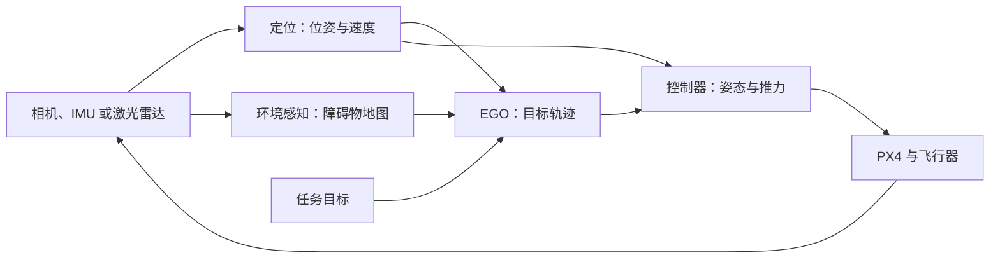

# 课程导读与学习路线

本课程围绕“让无人机根据环境自主运动”这一目标展开。先运行各模块，再理解模块之间的数据关系，最后逐步连接定位、规划与控制。学习顺序按知识依赖安排；已经完成的实验可以直接从结果检查开始。

## 1. 课程分为哪几个部分

| 部分 | 章节 | 学习目标 | 前置知识 |
| --- | --- | --- | --- |
| 开发基础 | 第一章：环境；第二章：工作空间 | 理解 Docker、依赖、ROS 2 包与构建产物 | 终端、目录和基本 Shell 命令 |
| 运动规划 | 第三章：仿真；第四章：源码 | 观察局部规划，理解状态机和轨迹生成 | 节点、话题、参数、基本 C++ |
| 飞控与定位 | 第五章：PX4；第六章：VINS | 分别验证物理起降与视觉惯性定位 | 坐标系、位置与姿态、时间戳 |
| 系统集成 | 第七章：接口 | 对齐消息、坐标和时间，建立反馈链路 | 前面模块的输入、输出与验收方式 |

第五章和第六章可以按兴趣选择阅读顺序；进入第七章前，应理解规划指令、定位反馈和飞控状态分别表示什么。

## 2. 先建立系统认识

下面是目标系统的概念图【待验证：完整联合飞行尚未验收】。定位提供运动状态，环境感知提供障碍物，两者共同支持规划；控制器根据目标与实际状态的差异驱动飞行器。

在不同实验中，输入来源不同：EGO 默认仿真使用简化运动反馈，EuRoC 实验使用录制的图像与 IMU，PX4 SITL 使用 Gazebo 的仿真传感器。连接模块时，反馈必须来自正在控制的同一架飞行器，不能将录制数据中的运动当作当前飞机的状态。

## 3. 按目标安排实验

| 顺序 | 实验与入口 | 完成标准 | 参考环境中的状态 |
| --- | --- | --- | --- |
| 1 | [开发环境](/getting-started/environment) | 能说明镜像、容器与工作空间的关系 | 【运行验证】Humble 底座已建立 |
| 2 | [构建工作空间](/ego-planner/build) | 编译成功，能找到包和可执行程序 | 【运行验证】20 包通过 |
| 3 | [运行规划仿真](/ego-planner/simulation) | 能设置目标，核对节点、指令与轨迹 | 【运行验证】8 节点、约 100 Hz 指令 |
| 4 | [阅读与修改源码](/ego-planner/source-reading) | 能沿状态机解释一次重规划，预测小修改结果 | 已提供阅读路线与练习；读者需自行完成练习 |
| 5 | [PX4 起降](/px4-sitl/environment#px4-116-acceptance) | 飞控状态与物理真值共同证明起降完成 | 【运行验证】v1.16.0 原厂 X500 通过 |
| 6 | [VINS 数据集实验](/vins-fusion/environment) | 识别输入配置，输出轨迹并理解评价限制 | 【运行验证】EuRoC MH_01_easy 运行通过 |
| 7 | [系统接口](/integration/interfaces) | 消息、坐标、时间和 QoS 对齐 | 【运行验证】适配与坐标桥；【待验证】飞行闭环 |

已有环境的读者不需要反复执行安装和完整构建。先检查版本与产物，再运行本章的验证命令。

## 4. 从仿真走向实机

实机路线使用 D435（USB）、Mid360（以太网）、Orin NX 和运行 PX4 v1.16.0 的 Pixhawk 6C mini；电机规格为 2812 980KV。以下为后续实验安排【待验证】，并非已经完成的部署指南。

1. **控制闭环：**在当前 SITL 基线上验证 px4ctrl 悬停、轨迹跟踪、指令超时和退出行为。
2. **实时定位：**检查传感器驱动、时间戳、坐标外参和数据质量，再评价定位结果；D435、Mid360 的方案分别按实际可用数据选择。
3. **机载计算：**在 Orin NX 上验证依赖、处理频率、延迟、内存与持续运行性能。
4. **飞控接入：**验证估计状态、控制指令与飞控模式，完成无桨检查后再制定约束场地试飞方案。

从数据集运行到实机定位，中间还包括标定、时间同步、坐标约定和性能测试。仅凭电机 KV 或仿真起飞结果，不能确定实机控制参数。

MuJoCo、Isaac Sim 和进一步的研究型演示作为扩展方向，在主要接口与评价方法稳定后按需求选择。本手册只为已展开的内容建立章节。

## 5. 如何完成一次学习实验

每次实验采用同一流程：**检查 → 修改 → 构建 → 运行 → 验证 → 记录 → 下一步**。读完一节后，尝试回答七个问题：目标是什么，为什么需要这一步，执行了哪些操作，结果是否符合预期，依据是什么，需要记住什么，下一步依赖哪些条件。

建议为每次修改留下简短实验记录：源码版本、修改位置、预期变化、实际结果和判断依据。一次只改变一个影响结果的条件，有助于把现象对应到具体原因。

## 延伸阅读

- [鱼香 ROS 2 Humble 章节导读](https://fishros.com/d2lros2/#/humble/chapt1/章节导读)：按基础选择 ROS 2 学习入口。
- [PX4 基本概念](https://docs.px4.io/main/en/getting_started/px4_basic_concepts.html)：无人机、飞控、地面站和机载计算机的职责。
- [Fast-Drone-250](https://github.com/ZJU-FAST-Lab/Fast-Drone-250)：参考其系统结构；ROS 1 部署步骤需要逐项核对接口与版本，不能直接替换命令。
