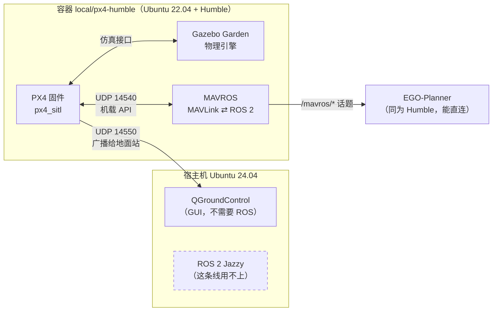

# 第五步：装 PX4 SITL + Gazebo + 地面站

::: tip 这一页你会得到什么

一个能跑真实 PX4 飞控固件的仿真环境：`local/px4-humble:latest` 镜像、编译好的 PX4 v1.15.4、Gazebo Garden、MAVROS，以及宿主机上的 QGroundControl 地面站。

前置：已完成 [第一步：搭环境](/getting-started/environment)，`local/ego-planner-humble:latest` 镜像存在。

预计时间：镜像构建 15~25 分钟，PX4 首次编译 10~20 分钟，中间你只需要敲 4 条命令。
:::

## 1. 先想清楚：这一套和前面的仿真有什么不一样

前面 EGO-Planner 的仿真里，"飞控"是个叫 `poscmd_2_odom` 的假节点——**你给它位置指令，它就直接把自己挪过去**，没有物理，没有姿态，没有推力。那一步的目的是验证规划算法，所以假身体够用。

这一步换成真东西：

| | EGO 自带仿真 | PX4 SITL |
| --- | --- | --- |
| 飞控 | `poscmd_2_odom`（假的） | **真的 PX4 固件**，和实机上跑的是同一份代码 |
| 物理 | 无（指令即状态） | Gazebo 刚体动力学 + 空气阻力 + 电机模型 |
| 通信 | ROS 2 话题直连 | **MAVLink 协议**，经 MAVROS 翻译成 ROS 2 话题 |
| 会不会摔 | 不会 | 会。姿态发散、推力不够、解锁条件不满足都会摔 |

::: tip 为什么必须过这一关
真机上你面对的是 MAVLink、飞行模式、解锁条件、offboard 超时这一整套东西，**这些在假飞控里一个都不存在**。SITL 的价值就是让你在不摔真飞机的前提下踩完这些坑。

记法：**假飞控证明"路规划对了"，PX4 SITL 证明"这架飞机真能这么飞"。**
:::

## 2. 为什么装进容器，而不是宿主机

三个理由，每一个单独都足够：

**理由 1：版本对不上。** 宿主机是 Ubuntu 24.04，而 PX4 v1.15.x 的官方安装脚本支持的是 20.04/22.04。在 24.04 上跑它，依赖名和 Gazebo 版本都会错位。

**理由 2：MAVROS 必须和 EGO 同一个 ROS 发行版。** 宿主机装的是 ROS 2 **Jazzy**，而 EGO 工作空间是 **Humble**。ROS 2 不同发行版之间**不能直接交换话题**（消息的类型哈希不同）。MAVROS 是要把飞控状态喂给 EGO 的，所以它必须是 Humble——也就是必须进容器。

**理由 3：不污染已经跑通的东西。** EGO 镜像是验证过的，不去动它。



::: warning 这张图里最容易忽略的一条
`QGroundControl` 装在**宿主机**，却能连上容器里的 PX4——靠的是容器用 `--network host`，容器和宿主机共享同一个网络栈。所以 PX4 往 UDP 14550 广播，对 QGC 来说就是本机的 14550。**如果改成默认的 bridge 网络，这条线就断了。**
:::

## 3. 镜像分层：为什么写成 `FROM local/ego-planner-humble`

`environments/px4-humble/Dockerfile` 的第一行是：

```dockerfile
FROM local/ego-planner-humble:latest
```

这一句省掉的东西比看起来多：

| 好处 | 具体是什么 |
| --- | --- |
| 复用已验证的底座 | 那个镜像的 Humble + CycloneDDS 组合已经跑通过完整仿真，不用再赌一次 |
| 磁盘几乎不多占 | Docker 层是共享的，磁盘上**不会出现第二份 Humble** |
| EGO 镜像零风险 | 加层是往上叠，底下那个镜像一个字节都不会变 |

::: tip 记忆方法
把 Docker 镜像想成**一叠透明胶片**。`FROM` 就是"在这叠胶片上面再放一张"。新胶片只画自己新增的内容，下面的胶片原封不动，而且另一个人也可以在同一叠上放他自己的胶片——这就是为什么 PX4 镜像和 VINS 镜像能同时 `FROM` 同一个底座。
:::

实测占用【运行验证】：

```
local/px4-humble:latest          6.27GB
local/vins-humble:latest         4.89GB
local/ego-planner-humble:latest  4.84GB
```

三个数字加起来是 16GB，但**磁盘上远没有 16GB**。`docker images` 显示的是"这个镜像从底到顶的总大小"，共享的层被重复计算了。VINS 镜像相对底座只真正多了约 50MB。

::: warning `docker system df` 的 RECLAIMABLE 也会骗你
它曾经报告"3.607GB 可回收"，实际执行 `docker image prune -f` 只释放了 **114.6kB**【运行验证】。原因是那些 `<none>` 镜像的层全部和 EGO 镜像共享，删掉标签并不会删掉层。**看到这个数字不要当真，先 prune 一次再看真实变化。**
:::

## 4. Dockerfile 三层逐层读

完整文件在 `environments/px4-humble/Dockerfile`，一共三个 `RUN` 层。**分成三层不是为了好看，是为了改一层不用重跑前面两层**——第 1 层要下载几百 MB，重跑一次很贵。

### 4.1 第 1 层：直接用 PX4 官方的依赖脚本

```dockerfile
ADD https://raw.githubusercontent.com/PX4/PX4-Autopilot/v1.15.4/Tools/setup/ubuntu.sh /tmp/px4-setup/ubuntu.sh
ADD https://raw.githubusercontent.com/PX4/PX4-Autopilot/v1.15.4/Tools/setup/requirements.txt /tmp/px4-setup/requirements.txt
RUN bash /tmp/px4-setup/ubuntu.sh --no-nuttx --no-sim-tools \
    && rm -rf /tmp/px4-setup /var/lib/apt/lists/*
```

**为什么不自己列一份包清单：** PX4 的依赖会随版本变，自己抄一份清单，下次升级就得重新对照。用官方脚本，等于把这份维护责任交还给上游。

**为什么用 `ADD` 拉两个文件而不是先 clone 整个仓库：** 那时候我们只需要装依赖，源码还没拉。整个 PX4 带子模块是 1GB 以上，为了两个脚本先下 1GB 不划算。

**为什么钉 `v1.15.4` 而不是 `main`：** 版本号写死，别人照着这页做才能得到同一个环境。这里钉的是 **tag** 而不是 commit——PX4 有正式发布 tag，`v1.15.4` 既可读又不可变。（EGO 那边只能钉 commit，因为它的 `ros2_version` 分支没有 tag。）

两个开关省掉的东西【源码确认：`ubuntu.sh` v1.15.4 共 277 行】：

| 开关 | 省掉什么 | 大约多大 | 为什么我们不需要 |
| --- | --- | --- | --- |
| `--no-nuttx` | ARM 交叉编译工具链 | ~1 GB | 那是**刷真实飞控固件**用的。SITL 编译的是 x86 程序 |
| `--no-sim-tools` | `ant` + `openjdk-11` + `libvecmath-java` | ~600 MB | 那些只服务 **jmavsim**（Java 写的老仿真器），我们用 Gazebo |

### 4.2 第 2 层：Gazebo 得自己重装一遍

`--no-sim-tools` 把 Java 和 Gazebo **一起**跳过了，所以 Gazebo 要手工补回来。这一层是照着 `ubuntu.sh` 里 22.04 那个分支抄的，只挑需要的包：

```dockerfile
RUN wget -q https://packages.osrfoundation.org/gazebo.gpg \
      -O /usr/share/keyrings/pkgs-osrf-archive-keyring.gpg \
    && echo "deb [arch=$(dpkg --print-architecture) signed-by=/usr/share/keyrings/pkgs-osrf-archive-keyring.gpg] http://packages.osrfoundation.org/gazebo/ubuntu-stable $(lsb_release -cs) main" \
      > /etc/apt/sources.list.d/gazebo-stable.list \
    && apt-get update && apt-get install -y --no-install-recommends gz-garden ...
```

::: warning 这里有个版本陷阱：是 Garden，不是 Harmonic
网上大量 PX4 教程写的是 `gz-harmonic`。但 **v1.15.4 的 `ubuntu.sh` 在 Ubuntu 22.04 上装的是 `gz-garden`**【源码确认：脚本第 192~272 行的仿真分支里，22.04 命中的是 `gazebo_packages="gz-garden"`】。

装错版本的后果不是报错，而是 `make px4_sitl gz_x500` 找不到对应的 Gazebo 插件——**症状是"模型起不来"，而不是"版本不对"**，非常难查。

记法：**Gazebo 版本跟着 PX4 版本走，不跟着教程走。** 想确认自己该装哪个，就去读你钉的那个 tag 下的 `Tools/setup/ubuntu.sh`。
:::

### 4.3 第 3 层：MAVROS 和那个必须补的数据集

```dockerfile
RUN apt-get update && apt-get install -y --no-install-recommends \
       ros-humble-mavros ros-humble-mavros-extras ros-humble-mavros-msgs \
    && rm -rf /var/lib/apt/lists/*
RUN set -eux; \
    script=$(find /opt/ros/humble -name 'install_geographiclib_datasets.sh' | head -1); \
    echo "使用 $script"; bash "$script"
```

第二个 `RUN` 是**最容易被漏掉的一步**。装完 mavros 还要装 GeographicLib 的大地水准面和地磁数据集，否则 `mavros_node` 一启动就抛 `GeographicLib::GeographicErr` 然后直接退出。

::: tip 为什么用 `find` 去找脚本，而不是写死路径
这个脚本是 mavros 包自带的，路径随 mavros 版本变过好几次。用 `find` 定位，等于"用这个包自己带的那份"，脚本和包版本永远一致。写死路径的教程，换个版本就断。
:::

## 5. 命令一：构建镜像

```bash
cd /home/yusei/Documents/Codex/drone-learning-lab/environments/px4-humble
bash build-image.sh
```

`build-image.sh` 做的第一件事是**检查底座在不在**：

```bash
base="local/ego-planner-humble:latest"
if ! sudo docker image inspect "$base" >/dev/null 2>&1; then
  echo "❌ 缺少底座镜像 $base"
  echo "   先执行：bash ../ego-humble/build-image.sh"
  exit 1
fi
```

::: tip 为什么值得多写这 5 行
不检查的话，`docker build` 会自己去 Docker Hub 找一个叫 `local/ego-planner-humble` 的镜像，然后报一个和真实原因毫无关系的网络错误。**提前检查前置条件，把"缺什么"直接说出来**，比让人对着 `pull access denied` 猜半小时强。
:::

::: warning 构建时不要用管道接 `tail`
第一次构建我写成了 `docker build ... | tail -40`，结果**什么输出都没有，镜像也没生成**【运行验证】。管道把输出缓冲吞掉了，失败信息全丢。正确做法是直接重定向到文件：

```bash
sudo docker build -t local/px4-humble:latest . > /tmp/px4-build.log 2>&1
```

然后另开一个终端 `tail -f /tmp/px4-build.log` 看进度。
:::

## 6. 命令二：验收镜像

镜像有了不等于对。跑一次自检：

```bash
sudo docker run --rm local/px4-humble:latest bash -lc '
echo "ROS_DISTRO : $ROS_DISTRO"
echo "gz sim     : $(gz sim --versions 2>&1 | head -1)"
echo "cmake      : $(cmake --version | head -1)"
echo "mavros     : $(ros2 pkg prefix mavros)"
echo "geoid 数据 : $(ls /usr/share/GeographicLib/geoids/ | head -1)"
'
```

本项目的真实输出【运行验证】：

```
ROS_DISTRO : humble
gz sim     : 7.9.0
cmake      : cmake version 3.22.1
mavros     : /opt/ros/humble
geoid 数据 : egm96-5.pgm
```

四件事被证明了，一条一条对应回去：

| 输出 | 证明了什么 | 不对会怎样 |
| --- | --- | --- |
| `humble` | 底座继承正确，将来能和 EGO 直连 | 跨版本，话题收不到 |
| `gz sim 7.9.0` | Garden 装上了（7.x = Garden，8.x = Harmonic） | 模型起不来，且不报版本错 |
| `mavros → /opt/ros/humble` | mavros 是从 apt 装的系统包 | 找不到包，launch 直接失败 |
| `egm96-5.pgm` 存在 | 地理数据集补上了 | `mavros_node` 抛 `GeographicErr` 退出 |

::: tip 记住 `gz sim --versions` 这条命令
不要用 `gz --version`——它打印的是一段帮助文字（"The 'gz' command provides a command line interface..."），看不出版本【运行验证】。**版本号在 `gz sim --versions` 里**。

Gazebo 版本号和代号的对应：**7.x = Garden，8.x = Harmonic**。记住这个映射，以后看到 `7.9.0` 就知道是 Garden。
:::

## 7. 命令三：拉 PX4 源码

```bash
cd /home/yusei/Documents/Codex/drone-learning-lab/environments/px4-humble
bash fetch-source.sh
```

源码落在 `~/Documents/Codex/px4-sitl/PX4-Autopilot`，**不在本仓库里**（1.2GB，不该进 Git）。

脚本核心就一条 clone：

```bash
git clone --depth 1 --branch v1.15.4 \
  --recurse-submodules --shallow-submodules \
  https://github.com/PX4/PX4-Autopilot.git "$DEST"
```

| 参数 | 作用 | 去掉会怎样 |
| --- | --- | --- |
| `--depth 1` | 只拉最新一次提交 | 要下载十几年的历史，慢很多 |
| `--branch v1.15.4` | 直接落在这个 tag 上 | 拿到 `main`，版本对不上 |
| `--recurse-submodules` | **PX4 有几十个子模块，缺一个就编不过** | 编译中途报找不到头文件 |
| `--shallow-submodules` | 子模块也只拉最新提交 | 子模块历史又是几百 MB |

::: warning `--depth 1` 会不会让 PX4 认不出自己的版本
不会——因为 `--branch` 指的是 tag。PX4 编译时会跑 `git describe` 拿版本号写进固件，只要 HEAD 正好在 tag 上就能算出来。验收一下【运行验证】：

```bash
git -C ~/Documents/Codex/px4-sitl/PX4-Autopilot describe --tags
```

```
v1.15.4
```

如果这里输出的是一串 commit 哈希而不是版本号，说明 tag 没跟过来，编译会得到一个版本号是 `0.0.0` 的固件。
:::

::: tip 脚本故意不帮你切版本
如果检测到本地 commit 和钉死的版本不一致，脚本只**打印**该执行的命令，不自动执行：

```
⚠️  和钉死的版本不一致
   如果确认本地没有你自己的改动，手动执行：
     git -C ... checkout v1.15.4
```

理由：自动 `git reset --hard` / `git clean -fd` 会把你在源码里做的实验**一并删掉**，而且不可恢复。**脚本可以帮你省事，但不该替你做不可逆的决定。**
:::

## 8. 命令四：编译 PX4

```bash
bash run-sitl.sh build
```

它起一个一次性容器，在里面执行 `/px4/build-px4.sh`，编完容器自删，产物留在挂载目录里。

### 8.1 本项目真实踩到的坑：一个和 git 毫无关系的 CMake 报错

第一次编译在配置阶段就死了【运行验证】：

```
CMake Error at CMakeLists.txt:123 (string):
  string sub-command REPLACE requires at least four arguments.
```

去看 `CMakeLists.txt:115` 附近【源码确认】：

```cmake
execute_process(
	COMMAND git describe --exclude ext/* --always --tags
	OUTPUT_VARIABLE PX4_GIT_TAG
	...)
# git describe to X.Y.Z version
string(REPLACE "." ";" VERSION_LIST ${PX4_GIT_TAG})
```

`PX4_GIT_TAG` 是空的，所以 `string(REPLACE "." ";" VERSION_LIST )` 只剩三个参数。**报错说的是 CMake 语法，真正的原因是 `git describe` 什么都没输出。**

在容器里手动跑一次，真凶就露出来了【运行验证】：

```bash
sudo docker run --rm -v ~/Documents/Codex/px4-sitl:/px4 \
  -w /px4/PX4-Autopilot local/px4-humble:latest \
  bash -lc 'git describe --always --tags'
```

```
fatal: detected dubious ownership in repository at '/px4/PX4-Autopilot'
To add an exception for this directory, call:
	git config --global --add safe.directory /px4/PX4-Autopilot
```

**原因：** 容器里是 root（uid 0），而挂进来的源码目录属主是宿主机用户（uid 1000）。git 2.35.2 之后遇到"仓库属主不是当前用户"会直接拒绝工作——这是个安全特性，防止你在别人的仓库里执行仓库配置里的钩子。

**修法**（写进 `build-px4.sh`，且必须在所有 git 命令之前）：

```bash
git config --global --add safe.directory '*'
```

用 `'*'` 而不是逐个列目录，因为 PX4 有几十个子模块，**每一个都是独立的 git 仓库**。这条只在一次性容器里生效，不动宿主机的 git 配置。

::: warning 这个坑会在所有"宿主机挂载 + 容器内 root"的组合里出现
只要满足这三个条件就会中：① 源码在宿主机上，② 用 `-v` 挂进容器，③ 容器里以 root 运行。而这正是本项目所有构建的标准姿势。

**识别特征：** 报错完全不提 git，而是某个变量莫名为空导致的下游错误。以后遇到"版本号是空的"、"`git rev-parse` 返回空"、"CMake 说参数不够"，**先在容器里手跑一次那条 git 命令**。

顺手加的一道保险（也写进了 `build-px4.sh`）——取不到版本号就别浪费十几分钟：

```bash
if [[ -z "$(git describe --tags 2>/dev/null)" ]]; then
  echo "❌ git describe 取不到版本号，编译必定在 CMake 阶段失败。"
  exit 1
fi
```
:::

### 8.2 编译产物的属主也要处理

容器里 root 写出来的 `build/` 在宿主机上是 root 所有，**你自己删不掉**（要密码）。所以 `run-sitl.sh build` 把宿主机的 uid 传进去：

```bash
$D run --rm \
  -e HOST_UID="$(id -u)" -e HOST_GID="$(id -g)" \
  -v "$PX4_ROOT:/px4" -w /px4 "$IMAGE" \
  bash -lc 'bash /px4/build-px4.sh'
```

`build-px4.sh` 编完在**容器内**改属主：

```bash
chown -R "$HOST_UID:$HOST_GID" /px4/PX4-Autopilot/build
```

::: tip 为什么在容器里 chown，而不是在宿主机上 sudo chown
容器里本来就是 root，chown 不需要额外权限。而宿主机上执行 `sudo chown` 会**要密码**——本项目的免密 sudo 规则只覆盖 `/usr/bin/docker`。

**这个模式值得记住**：凡是容器往挂载目录里写东西，就在同一个 `docker run` 里顺手把属主改回来。数据集转换那一步用的也是这个招。
:::

### 8.3 第二个坑：编译中途"静默挂住"，因为编译期要联网

第二次编译走到一半就不动了。表现极具误导性【运行验证】：

```
[528/1029] Generating uORB topic ucdr headers
```

停在这一行，**不报错，不退出**，看起来像在编译一个很大的文件。真正的判据是 CPU：

```bash
sudo docker stats --no-stream
```

```
CPU %
0.08%
```

**0.08% 不是在编译，是在等待。** 用 `docker top` 看容器里到底在跑什么：

```bash
sudo docker top <容器名>
```

结果指向 `microcdr-gitclone.cmake`。

::: warning 原因：PX4 在**编译过程中**要 git clone
PX4 的 `uxrce_dds_client` 模块用 CMake 的 `ExternalProject`，在 build 中途现场从 GitHub 克隆 eProsima 的 Micro-CDR 和 Micro-XRCE-DDS。

而我的编译容器用的是 Docker 默认的 **bridge 网络**。宿主机的代理在 `127.0.0.1:17892`，但在 bridge 网络的容器里，`127.0.0.1` 指的是**容器自己**——那里什么都没有。git 于是一直等到超时（很久）。

**为什么不报错**：git clone 在等 TCP 连接，这在它看来是正常的网络延迟，不是错误。
:::

修法是给编译容器 `--network host` 并把代理变量传进去（写进 `run-sitl.sh` 的 `build` 分支）：

```bash
$D run --rm --network host \
  -e http_proxy="${http_proxy:-}" \
  -e https_proxy="${https_proxy:-}" \
  -e no_proxy="${no_proxy:-}" \
  ...
```

验证这条修法有效，用 `git ls-remote` 单独试一次（**不要靠重新编译来验证**，那要等十几分钟）：

```bash
# 改之前：bridge 网络，会一直挂住
sudo docker run --rm local/px4-humble:latest \
  bash -lc 'timeout 20 git ls-remote https://github.com/eProsima/Micro-CDR.git HEAD; echo "退出码 $?"'

# 改之后：host 网络 + 代理，立刻返回 SHA
sudo docker run --rm --network host \
  -e http_proxy="$http_proxy" -e https_proxy="$https_proxy" \
  local/px4-humble:latest \
  bash -lc 'timeout 20 git ls-remote https://github.com/eProsima/Micro-CDR.git HEAD'
```

::: tip 顺手把这个自检写进脚本
`build-px4.sh` 在开编译之前先试 5 秒网络，不通就直接退出。**用 20 秒换掉十几分钟的盲等，非常值。**

```bash
if timeout 20 git ls-remote https://github.com/eProsima/Micro-CDR.git HEAD >/dev/null 2>&1; then
  echo "✅ GitHub 可达"
else
  echo "❌ 容器里访问不了 GitHub。编译会在 uxrce_dds_client 那一步静默挂住。"
  exit 1
fi
```

记法：**"卡住"和"在算"的区别只能靠 CPU 占用来分。看到进度条不动，先看 `docker stats`，不要盯着日志等。**
:::

::: warning `timeout` 管不住 `docker run` 里的容器
测试时我写了 `timeout 25 sudo docker run ...`，结果没有生效【运行验证】。`timeout` 杀掉的是**宿主机上的 docker 客户端**，容器还在后台跑。

正确写法是把 `timeout` 放进**容器里面**：

```bash
sudo docker run --rm IMAGE bash -lc 'timeout 20 git ls-remote ...'
```
:::

### 8.4 第三个坑：NuttX 子模块没有 tag

网络修好之后又失败了，而且这次的报错**藏在几百行并行编译输出的中间**。日志末尾只有一句没有信息量的：

```
ninja: build stopped: subcommand failed.
make: *** [Makefile:227: px4_sitl_default] Error 1
```

::: tip 找 ninja 的真实报错，不要用 `tail`
ninja 是并行编译的：某个任务失败后，其他已经启动的任务会**继续跑完**并继续打印。所以真正的报错在日志**中间**，末尾全是无关的成功行。

用 grep 定位，别用 tail：

```bash
grep -nE 'FAILED|error:|Error [0-9]' px4-compile.log
```
:::

这样一 grep，真凶就出来了【运行验证】：

```
FAILED: src/lib/version/build_git_version.h
cd /px4/PX4-Autopilot && /usr/bin/python3 src/lib/version/px_update_git_header.py ... --validate
Traceback (most recent call last):
  File ".../px_update_git_header.py", line 138, in <module>
    nuttx_git_tag = re.findall(r'nuttx-[0-9]+\.[0-9]+\.[0-9]+', nuttx_git_tags)[-1].replace("nuttx-", "v")
IndexError: list index out of range
```

去读那一段源码【源码确认：`px_update_git_header.py` 第 135~139 行】：

```python
if (os.path.exists('platforms/nuttx/NuttX/nuttx/.git')):
    nuttx_git_tags = subprocess.check_output('git -c versionsort.suffix=- tag --sort=v:refname'.split(),
                                  cwd='platforms/nuttx/NuttX/nuttx', ...)
    nuttx_git_tag = re.findall(r'nuttx-[0-9]+\.[0-9]+\.[0-9]+', nuttx_git_tags)[-1]...
```

链条是这样的：

1. 我们 clone 时用了 `--shallow-submodules`，**tag 不会跟着浅克隆过来**。
2. 于是 NuttX 子模块里 `git tag` 输出是空的。
3. `re.findall(...)` 返回空列表 `[]`。
4. `[]` 取 `[-1]` → `IndexError`。

验证第 2 步【运行验证】：

```bash
git -C ~/Documents/Codex/px4-sitl/PX4-Autopilot/platforms/nuttx/NuttX/nuttx tag | wc -l
```

```
0
```

**修法**：只补抓一个 tag，写进 `fetch-source.sh`：

```bash
git -C platforms/nuttx/NuttX/nuttx fetch --depth 1 origin tag nuttx-12.12.0
```

实测代价：**约 1 MB、约 2 秒**【运行验证】。

::: tip 为什么只抓一个 tag 就够，而且结果和完整克隆一模一样
关键在那行代码：它把**所有** tag 排序后取**最后一个**（最高版本），这个结果**和 HEAD 在哪个 commit 上完全无关**。

所以只要本地那一个 tag 就是上游最高的那个（`nuttx-12.12.0`，用 `git ls-remote --tags origin 'nuttx-*'` 查到的），生成的版本号就和完整克隆逐字节相同。这不是猜一个值糊过去，是算出同一个值。

验证一下生成的头文件【运行验证】：

```
#define NUTTX_GIT_VERSION_STR  "5d74bc138955e6f010a38e0f87f34e9a9019aecc"
#define NUTTX_GIT_TAG_STR  "v12.12.0"
```
:::

::: warning 这个坑的通用形态：浅克隆省下的东西，可能正是构建要用的
`--depth 1` / `--shallow-submodules` 省时间省流量，代价是**丢掉历史和 tag**。而很多项目的构建系统会用 `git describe` / `git tag` 生成版本号。

**识别特征：构建报错发生在"生成版本头文件"这一步，而且报的是空列表、空字符串、参数不够这类下游错误。** 8.1 那个 `string sub-command REPLACE` 也是同一类——都是"git 取不到东西"伪装成别的错误。

顺手也加了一道 1 秒的前置检查（写进 `build-px4.sh`），不用再等 4 分钟才知道：

```bash
nuttx=platforms/nuttx/NuttX/nuttx
if [[ -e "$nuttx/.git" && -z "$(git -C "$nuttx" tag 2>/dev/null)" ]]; then
  echo "❌ NuttX 子模块没有任何 git tag，编译必定在 build_git_version.h 失败。"
  exit 1
fi
```
:::

::: tip 顺带一句：SITL 根本用不到 NuttX
NuttX 是**真实飞控硬件**上的实时操作系统。我们编的是 x86 的 SITL，一行 NuttX 代码都不会被编进去。这里补 tag，纯粹是为了让 PX4 的版本头文件生成脚本能跑完——它不管你编的是哪个目标，都会去读这个子模块。

（那 222MB 的 NuttX 子模块确实是白占的。但把它删掉的收益不值得引入一个"和上游不一样的源码树"的风险，所以留着。）
:::

### 8.5 为什么不加 `-j`

```bash
make px4_sitl_default   # 就这样，不要 -j16
```

PX4 的 Makefile 内部已经调用 ninja 并按 CPU 核数并行。再手动加 `-j` 会让并发数翻倍，**16GB 内存会被吃满**。

### 8.6 编译成功长什么样

三个坑都修完之后，本项目的真实结尾【运行验证】：

```
[438/440] Linking CXX executable bin/px4
[439/440] Building CXX object src/examples/dyn_hello/.../hello.cpp.o
[440/440] Linking CXX shared library .../examples__dyn_hello.px4mod

=== 验收：二进制是否生成 ===
-rwxr-xr-x 1 root root 50M Sep  4 10:11 build/px4_sitl_default/bin/px4
✅ PX4 SITL 编译成功。
→ build/ 属主已改回 1000:1000
```

这段日志里的 `root root` 不用担心：那一行 `ls` 是在 chown **之前**跑的，所以打印的还是容器视角的属主。下一行的 `→ build/ 属主已改回 1000:1000` 才是最终结果，在宿主机上看到的是你自己。

::: tip 为什么目标总数从 1029 变成了 440
第一次编译（1029 个目标）在中途失败，但**已经编好的 .o 文件留在 `build/` 里了**。ninja 会检查哪些产物已经是最新的，只重编剩下的。所以后面几次重试的目标数越来越少。

这也是**不要删掉 `build/` 重来**的理由——除非你怀疑 build 目录本身坏了。
:::

自己再验收两条：

```bash
# 1) 产物在宿主机上，属主是你自己（不是 root）
ls -lh ~/Documents/Codex/px4-sitl/PX4-Autopilot/build/px4_sitl_default/bin/px4
```

```
-rwxr-xr-x 1 yusei yusei 50M  9月  4 18:11 .../bin/px4
```

属主是 `yusei yusei`，说明 8.2 那个 chown 生效了。

```bash
# 2) 二进制真的能执行（不是一个坏文件）
sudo docker run --rm -v ~/Documents/Codex/px4-sitl:/px4 local/px4-humble:latest \
  bash -lc '/px4/PX4-Autopilot/build/px4_sitl_default/bin/px4 -h 2>&1 | head -4'
```

```
Usage for Server/daemon process:

    px4 [-h|-d] [-s <startup_file>] [-t <test_data_directory>] ...
```

::: warning 注意是 `-h` 不是 `--help`
`px4 --help` 会报 `ERROR [px4] unrecognized flag`【运行验证】——它只认单横线的 `-h`。这不是编译坏了，只是这个程序的参数风格比较老。
:::

## 9. 两个必须记住的端口：14550 和 14540

PX4 不用 ROS 话题和外界说话，它用 **MAVLink**——一个跑在 UDP 上的二进制协议。SITL 启动后会开好几个 UDP 端口，其中你只需要记住两个：

| 端口 | 给谁用 | 谁来连 | 语义 |
| --- | --- | --- | --- |
| **14550** | 地面站 | QGroundControl | PX4 主动**广播**出去，地面站被动监听 |
| **14540** | 机载软件 / offboard 控制 | MAVROS | 双向，用来下发控制指令 |

::: tip 怎么记住哪个是哪个
**14550 是"给人看的"，14540 是"给程序用的"。**

数字上 50 > 40，可以联想成"5 像 See（看）"→ 地面站给人看；"4 像 For（给）"→ 给代码用。记不住联想也没关系，记住**QGC = 14550，MAVROS = 14540** 这两个组合就够了。
:::

::: warning 但"PX4 监听哪个端口"是另一个问题，我在这里判断错过
我曾经想确认 MAVLink 通不通，就在宿主机上查有没有开 14550：

```bash
ss -lunp | grep -E '145[0-9][0-9]'
```

结果没找到 14550，我就报告"QGC 连不上"。**这个结论是错的**，而且错了两层：

1. **方向搞反了。** 14550 是 QGC **监听**的端口，PX4 只是往这个地址**发**。QGC 没开的时候，14550 上当然什么都没有 —— 这是正常的，不是故障。
2. **过滤条件把真正的端口滤掉了。** PX4 自己监听的端口不是 145xx。读 PX4 的启动脚本【源码确认】：

```bash
# ROMFS/px4fmu_common/init.d-posix/px4-rc.mavlink
udp_gcs_port_local=$((18570+px4_instance))       # 给地面站那条链路，PX4 本地用 18570
udp_offboard_port_local=$((14580+px4_instance))  # 给机载软件那条链路，PX4 本地用 14580
udp_offboard_port_remote=$((14540+px4_instance)) # PX4 往 14540 发，MAVROS 在那儿收
```

所以完整的图是：

| 链路 | PX4 本地端口 | 对方端口 |
| --- | --- | --- |
| PX4 ↔ 地面站 | **18570** | 14550（QGC 监听） |
| PX4 ↔ 机载软件 | **14580** | 14540（MAVROS 监听） |

想真正确认有没有 MAVLink 数据，别猜端口，直接**自己绑一个端口收包看**：

```bash
python3 - <<'EOF'
import socket
s = socket.socket(socket.AF_INET, socket.SOCK_DGRAM)
s.bind(('127.0.0.1', 14550)); s.settimeout(5)
d, addr = s.recvfrom(2048)
print(f"收到 {len(d)} 字节，来自 {addr}，首字节 0x{d[0]:02x}")
EOF
```

真实输出【运行验证】：

```text
收到 48 字节，来自 ('127.0.0.1', 18570)，首字节 0xfd
```

这一条输出同时证明了三件事：数据在流、发送方是 18570（不是 14550）、`0xfd` 是 **MAVLink v2** 的起始魔数（`0xfe` 是 v1）。

**教训：用 `grep` 过滤诊断输出时，过滤条件本身就是一个假设。** 我假设"端口一定是 145xx"，于是把答案过滤掉了，还把"没找到"当成了证据。看不到东西的时候，先怀疑自己的筛子。
:::

`run-sitl.sh` 里 MAVROS 的连接串是这样写的：

```bash
FCU_URL="udp://:14540@127.0.0.1:14557"
```

这个格式要拆开读，很多人在这里卡住：

| 片段 | 含义 |
| --- | --- |
| `udp://` | 用 UDP（MAVLink 的默认传输） |
| `:14540` | **本地**监听端口——MAVROS 在这个端口收 PX4 发来的包 |
| `@127.0.0.1` | **远端**地址——PX4 在哪 |
| `:14557` | **远端**端口——MAVROS 往这里发指令 |

记法：**`@` 前面是"我在哪收"，`@` 后面是"我往哪发"。**

::: warning 为什么 QGC 装在宿主机也能连上容器里的 PX4
因为容器用了 `--network host`：容器**不建自己的网络栈**，直接用宿主机的。所以容器里的 PX4 往 `14550` 广播，等于宿主机的 `14550` 上有数据，QGC 就收到了。

**如果换成 Docker 默认的 bridge 网络，这条线立刻断**——容器有独立 IP，UDP 广播出不来（除非手工做端口映射，而 MAVLink 的双向 UDP 用端口映射很难配对）。

这也是为什么 `common_args` 里 `--network host` 不是随手加的，它是这套东西能通的前提。
:::

## 10. 命令五：装 QGroundControl（宿主机）

QGroundControl（简称 QGC）是 PX4 官方地面站。它的作用：看飞机状态、改参数、规划航线、手动解锁起飞。**这一步装在宿主机，不进容器**——它是个 GUI 程序，不需要 ROS。

```bash
cd /home/yusei/Documents/Codex/drone-learning-lab/environments/px4-humble
bash install-qgc.sh
```

整个过程**不需要 sudo**。真实输出【运行验证】：

```
→ 解包（避开 libfuse2）
✅ 解包完成。
→ 启动器：/home/yusei/.local/bin/qgroundcontrol

✅ 装好了。启动：
     qgroundcontrol
```

### 10.1 为什么要"解包"，而不是直接跑 AppImage

QGC 官方发的是 **AppImage**——一个把整个程序打包成单文件的格式。理论上 `chmod +x` 然后双击就能跑。但在 Ubuntu 24.04 上跑不起来。

::: warning AppImage 在 Ubuntu 24.04 上的通用坑：缺 libfuse2
AppImage 的运行原理是把自己**挂载**成一个临时文件系统，这需要 **libfuse2**。而 Ubuntu 24.04 只带 `fuse3` / `libfuse3-3`，**没有 libfuse2**。

症状是一句很难联想到 fuse 的报错，大意是"无法挂载 AppImage / dlopen libfuse.so.2 失败"。

网上的标准答案是 `sudo apt install libfuse2`——但那要密码，而且在 24.04 上还要装一个过时的兼容包。
:::

我们用的是**免 sudo 的办法**：AppImage 自带一个解包开关，把里面的东西释放成普通目录，然后直接运行里面的 `AppRun`：

```bash
cd ~/Applications
./QGroundControl-x86_64.AppImage --appimage-extract   # 解包一次
mv squashfs-root QGroundControl
```

然后写一个两行的启动器到 `~/.local/bin/qgroundcontrol`：

```bash
#!/usr/bin/env bash
exec "$HOME/Applications/QGroundControl/AppRun" "$@"
```

::: tip 为什么不用 `--appimage-extract-and-run`
那个开关也能免 libfuse2 跑起来，但它**每次启动都重新解包一遍将近 200MB**，启动会明显变慢，还反复写磁盘。

`--appimage-extract` 只解一次，之后每次启动就是运行一个普通目录里的程序。**一次性的麻烦换掉每次的麻烦。**
:::

### 10.2 脚本里的一道校验，值得学

```bash
head -c 4 "$APPIMAGE" | grep -q ELF || { echo "❌ 文件头不是 ELF"; exit 1; }
```

::: warning 为什么要检查文件头
从 GitHub Releases 下载有个经典陷阱：下载链接会跳转到 CDN，如果 CDN 返回 **403 错误页**，`curl` 会**把那个 HTML 错误页存成文件**并且退出码为 0——你会得到一个几 KB 大小、名字叫 `.AppImage` 的 HTML 文件。

直接运行它会报一句莫名其妙的 `cannot execute binary file`。

Linux 可执行文件的头 4 个字节固定是 `\x7fELF`。检查一下这 4 个字节，**就能把"下载到错误页"和"程序真的坏了"分开**。

这个技巧对所有"下载二进制"的场景都成立：**下载完先验证文件类型，别等到运行时才发现。**
:::

### 10.3 真机才需要的两条命令（现在不用做）

脚本最后会提醒两条要密码的命令，**接真实飞控（USB 串口）时才需要**：

```bash
sudo usermod -a -G dialout $USER   # 让自己有权限读串口设备
sudo apt remove modemmanager       # 它会把飞控误认成调制解调器并抢占串口
```

::: tip 为什么现在不做
SITL 全程走 UDP，一个串口都不涉及。而 `usermod` 改的是你的用户组，要重新登录才生效；`apt remove modemmanager` 动的是系统服务。**没有用到就不动它**，等真机那一步再说。

（这也是本项目的一条通则：**要密码的命令留给你自己执行**，脚本只负责告诉你该敲什么。）
:::

## 11. 命令六：只下载 px4ctrl，暂时不集成

```bash
bash fetch-px4ctrl.sh
```

源码落在 `~/Documents/Codex/px4ctrl-ros2/px4ctrl-ros2-fast-drone`，钉在 commit `85032f1`。

### 11.1 px4ctrl 是拼图里缺的那一块

前面我们有了两头，中间是断的：


**断在哪：** EGO 说的是"下一秒飞到这个位置，速度这么大"，而 PX4 的 offboard 接口要的是"机体应该摆成什么姿态、油门开多大"。这两种语言之间要有人翻译。

px4ctrl 就是这个翻译器。它做的事：

| 输入 | 处理 | 输出 |
| --- | --- | --- |
| EGO 的轨迹点、MAVROS 的当前状态、遥控器信号 | 位置环 → 姿态解算；同时管解锁、起飞、降落、遥控器接管 | `mavros_msgs/AttitudeTarget` |

::: tip 除了"翻译"，它还管一件更重要的事：安全接管
px4ctrl 会一直盯着遥控器。你随时可以拨一个开关，把控制权从"程序自动飞"抢回"手动飞"。

**真机上这不是可选功能，是保命功能。** 算法跑飞的时候，唯一能救飞机的就是这个开关。SITL 阶段就要把这套逻辑跑通，而不是等到真机才第一次用它。
:::

### 11.2 为什么这一步只下载、不集成

这个仓库是 [Ethan-02/px4ctrl-ros2-fast-drone](https://github.com/Ethan-02/px4ctrl-ros2-fast-drone)——把 Fast-Drone-250 里 ROS 1 版的 px4ctrl 移植到 ROS 2 的第三方成果。

::: tip 为什么用别人的移植，而不是自己写
把一个控制器从 ROS 1 翻到 ROS 2，工作量不小而且容易翻错（回调机制、参数声明、QoS 都变了）。**已经有人做过的事就不要重做**——这是本项目一贯的取法（EuRoC 数据集转换那一步也是直接用 `rosbags`，没有自己写转换器）。
:::

但**现在还不能编进工作空间**，有三个具体原因：

**原因 1：包名冲突。** 它带一个自己的 `quadrotor_msgs`，而 EGO 工作空间里已经有一个**同名但内容不同**的包。两个同名包放进同一个 colcon 工作空间，`colcon build` 会挑一个、忽略另一个，而且不一定报错——**编出来的东西是错的，但看起来是成功的**。这类问题必须单独处理，不能顺手带过。

**原因 2：这个仓库自己也没完工。** 它的 `package.xml` 里 license 字段写的是 `TODO`，作者在 README 里写了「可能不会继续了」，EGO 那一侧的对接也没做完。**这不是"下载即可用"的东西，是一个需要我们自己补完的起点。**

**原因 3：先把地基验完。** 现在 PX4 能不能起飞、MAVROS 能不能通、QGC 能不能连，都还没验。**在地基没验之前接上层建筑，出了问题不知道该怪哪一层。**

::: warning 那为什么现在就要下载
因为**钉版本这件事必须趁早**。这个仓库没有发布 tag，只能钉 commit。等到几个月后再下载，主分支可能已经变了，那时候文档里的行为就对不上了。

现在钉住 `85032f1`，写进脚本，任何人照着这页做都拿到同一份代码。**下载 ≠ 使用，钉版本是为了将来能重现。**
:::

::: tip 尊重上游
这个仓库的 license 字段是 `TODO`，也就是**作者没有明确授权**。所以本项目：只在脚本里 `git clone` 它，**不把它的任何源码复制进本仓库**，也不改写它的 README 当成自己的东西。将来真要集成，需要的改动会以补丁/说明的形式记录，并注明来源。
:::

## 12. 起飞验收：让这架飞机真的飞起来

编译成功只证明**代码能变成二进制**。这一节要证明的是**这架飞机能飞** —— 这是两件完全不同的事，中间隔着物理仿真、状态估计、控制器和通信链路。

### 12.1 起飞前：把三个进程拉起来

```bash
bash environments/px4-humble/run-sitl.sh start    # PX4 固件 + Gazebo 物理仿真
bash environments/px4-humble/run-sitl.sh mavros   # MAVLink → ROS 2 话题
```

`start` 只起了 Gazebo 的**服务端**（物理计算），屏幕上不会有窗口。要看画面得单独起 GUI：

```bash
xhost +local:                                     # 见下面的说明，这一步不能省
sudo docker exec -d px4_sitl bash -lc 'gz sim -g'
```

::: warning `xhost +local:` 为什么是必须的
不加这一步，`gz sim -g` 会直接崩，日志长这样【运行验证】：

```text
Authorization required, but no authorization protocol specified
qt.qpa.xcb: could not connect to display :0
qt.qpa.plugin: Could not load the Qt platform plugin "xcb"
```

原因：X 服务器的访问控制列表里只有 `SI:localuser:yusei`（你），而**容器里的进程是 root**，不在名单上，所以被拒。

`xhost +local:` 的意思是"允许本机 Unix socket 上的连接"。注意它和 `xhost +`（允许**全网**任何机器连你的显示器）完全不是一回事 —— 后者是真的危险，不要用。

用完记得收回来：

```bash
xhost -local:
```

**放开的权限用完就收，这个习惯比记住命令重要。**
:::

### 12.2 打开地面站并起飞

```bash
~/.local/bin/qgroundcontrol &
```

QGC 启动后**自动**监听 14550，不需要任何连接配置。10~20 秒后：

- 左上角从「未连接」变成显示飞机状态、电池、GPS
- 地图上飞机出现在瑞士苏黎世附近（PX4 SITL 的默认起飞点写死在那儿）
- 状态应为 **Ready To Fly**

然后点左侧 **`Takeoff`**，右边会出现一个**滑动确认条**。

::: tip 看到滑动条不是卡住了
QGC 对所有"会让飞机动起来"的操作都要求滑动而不是单击。真机上误点一次起飞是会伤人的，所以这个设计在仿真里也保留着。**向右滑到底**才算确认。
:::

### 12.3 验收：用两个互相独立的来源

界面上的数字**不能作为验收依据** —— 它和飞控的估计是同一个来源。要用两个独立来源交叉确认。

来源一，飞控自己的估计（经 MAVROS 桥出来的 ROS 2 话题）：

```bash
sudo docker exec px4_mavros bash -lc \
  'source /opt/ros/humble/setup.bash; ros2 topic echo /mavros/state --once'
sudo docker exec px4_mavros bash -lc \
  'source /opt/ros/humble/setup.bash; ros2 topic echo /mavros/local_position/pose --once'
```

来源二，仿真器里的**物理真值**：

```bash
sudo docker exec px4_sitl bash -lc \
  'gz topic -e -t /world/default/dynamic_pose/info -n 1' | grep -A5 'name: "x500_0"'
```

本项目的真实验收结果【运行验证】：

| 检查项 | 起飞前 | 悬停时 |
| --- | --- | --- |
| `armed` | `false` | **`true`** |
| `system_status` | `3`（待机） | **`4`（在飞）** |
| `mode` | `AUTO.LOITER` | `AUTO.TAKEOFF` → `AUTO.LOITER` |
| EKF 估计高度 | 0.077 m | **2.78 m** |
| Gazebo 物理真值 | — | **2.65 m** |
| 垂直速度 | — | 0.019 m/s（悬停） |

高度抖动小于 0.05 m、垂直速度接近零 —— 是**稳定悬停**，不是还在爬升或者在往下掉。这一点必须看速度才能确认，只看高度看不出来。

::: info 为什么悬停高度是 2.5 米，不是 10 米
这个高度不是随机的，它写在 PX4 源码里【源码确认】：

```c
// src/modules/navigator/mission_params.c:58
PARAM_DEFINE_FLOAT(MIS_TAKEOFF_ALT, 2.5f);
```

2.5 m（相对起飞点）+ 起飞点本身的 0.077 m ≈ 2.58 m，和实测 2.65 m 对得上。想改起飞高度就改 `MIS_TAKEOFF_ALT` 这个参数，QGC 里能直接改。

**遇到一个"默认值"，去源码里把它找出来。** 找到之后你就从"背住 2.5"变成"知道它在哪、能改它"。
:::

### 12.4 降落：顺便学会用 MAVROS 下指令

QGC 左侧点 `Land` 同样滑动确认。但**不用 QGC 也能降** —— MAVROS 把 MAVLink 指令暴露成了 ROS 2 service：

```bash
sudo docker exec px4_mavros bash -lc 'source /opt/ros/humble/setup.bash;
  ros2 service call /mavros/cmd/land mavros_msgs/srv/CommandTOL \
  "{min_pitch: 0.0, yaw: 0.0, latitude: 0.0, longitude: 0.0, altitude: 0.0}"'
```

返回【运行验证】：

```text
mavros_msgs.srv.CommandTOL_Response(success=True, result=0)
```

::: tip 这条命令的意义比"降落"大得多
`ros2 service list | grep mavros/cmd` 会列出 `arming` / `takeoff` / `land` / `takeoff_local` / `land_local` 等等。

**能从命令行发出的指令，就能从代码里发出。** 这正是后面 px4ctrl 要做的事 —— 它不点按钮，它订阅 EGO-Planner 的规划输出，然后往 MAVROS 发指令。你现在手动调用的这个 service，就是那条自动化链路上的一环。

`success=True` 只表示 **PX4 接受了这条指令**，不表示动作完成了。要确认降落完成，还是得回去看 `armed` 和高度。
:::

降落完成的判据【运行验证】：`armed` 变回 `false`（PX4 落地自动上锁），Gazebo 真值 `z: -0.013` 且三次采样完全不变。

### 12.5 一个真实的观察：EKF 高度有约 1 米的游走

落地后飞控估计的高度**不是** 0.077，而是在 0.5~1.3 m 之间慢慢游走，而 Gazebo 真值稳定在 -0.013 m 一动不动。

查 `/mavros/altitude` 能看到这是哪个量的问题【运行验证】：

```text
monotonic: 0.225
amsl: 1.022
local: 1.344          ← 游走的是这个
relative: 0.227       ← 这个基本是对的
terrain: 1.246
bottom_clearance: 0.098
```

`relative`（相对起飞点）读 0.23 m，基本正确，而 PX4 的起飞降落逻辑用的正是这个量，所以飞行没受影响。游走的是 `local`。原因【推测】是 SITL 模拟的气压计漂移，在静止、无运动激励时缺少足够的观测把它拽回来。它 20 秒后自己回落到 0.53 m，**没有发散**，所以是有界误差，不是 EKF 坏了。

::: warning 这一节是整页最该带走的东西
如果我只看 `/mavros/local_position/pose`，我会得出"飞机悬停在 1.3 米还在往上爬"。真值是它停在地上一动不动。

**三条结论：**

1. **估计值不是真值。** 飞控报的位置是算出来的，带误差。仿真里你能同时拿到"飞机以为自己在哪"和"飞机真的在哪"，真机上永远只有前者 —— 所以要在仿真里就养成对比的习惯。
2. **"高度"不是一个量，是一堆量。** `local` / `relative` / `amsl` / `terrain` / `bottom_clearance` 含义各不相同，拿错一个结论就反了。用之前先搞清楚它相对什么。
3. **有界误差和发散是两回事。** 看到数字不对先别下结论，多采几个点看趋势。回落了就是抖动，一直涨才是坏了。

这三条到 VINS 那边一字不改地适用 —— VINS 输出的位姿同样只是"估计"。
:::

### 12.6 收尾

```bash
bash environments/px4-humble/run-sitl.sh stop   # 停掉两个容器
xhost -local:                                   # 收回 X 访问权限
```

至此 **阶段二完成**：PX4 能编、能起、能连地面站、能飞、能降，而且每一条都有两个独立来源验证过。

## 记忆卡：PX4 SITL 环境

::: info 一句话理解
把**真实飞控固件**跑在电脑上，用 Gazebo 给它一副有物理的身体，再用 MAVROS 把它的 MAVLink 翻译成 ROS 2 话题，这样上层算法看到的接口和真机完全一样。
:::

**三个关键词：** MAVLink（协议）、SITL（Software In The Loop，固件跑在电脑上）、MAVROS（协议翻译器）

**输入 → 处理 → 输出**

| | 内容 |
| --- | --- |
| 输入 | `local/ego-planner-humble` 底座镜像；PX4 源码 v1.15.4；宿主机的 X11 和显卡 |
| 处理 | 镜像加三层（PX4 依赖 / Gazebo Garden / MAVROS+地理数据集）→ 容器内编译出 x86 的 px4 二进制 |
| 输出 | `build/px4_sitl_default/bin/px4`（50MB）；`local/px4-humble:latest` 镜像；宿主机上的 `qgroundcontrol` |

**四个必须记住的数字/名字**

| 记什么 | 值 | 记错的后果 |
| --- | --- | --- |
| Gazebo 代号 | **Garden**（7.x），不是 Harmonic | 模型起不来，且不报版本错 |
| 地面站端口 | **14550** | QGC 连不上 |
| offboard 端口 | **14540** | MAVROS 连不上 |
| 容器网络 | **`--network host`** | QGC 断线 + 编译期 clone 静默挂住 |

**这一页踩过的坑，按"识别特征"记**

| 症状 | 真正原因 | 修法 |
| --- | --- | --- |
| CMake 说 `string REPLACE` 参数不够 | 容器 root 挂宿主机目录 → git 拒绝工作 → `git describe` 空 | `git config --global --add safe.directory '*'` |
| 进度条不动，**CPU 0%** | 编译期要 clone GitHub，容器网络不通 | `--network host` + 传代理变量 |
| 日志尾部只有 `build stopped`，报错看不见 | ninja 并行，真报错在**中间** | 用 `grep -nE 'FAILED\|error:'`，别用 `tail` |
| `IndexError: list index out of range` | 浅克隆没带 NuttX 的 tag | `git fetch --depth 1 origin tag nuttx-12.12.0` |
| 脚本一行没跑，只报 `unbound variable` | `set -u` 撞上 ROS 的 setup.bash | 先 `set -eo pipefail`，source 完再 `set -u` |
| `cannot execute binary file` | 下载到的是 CDN 的 403 HTML 页 | `head -c 4 file \| grep ELF` 先验文件头 |

## 自测题

::: details 1. 为什么 MAVROS 必须装在 Humble 容器里，而不是宿主机的 Jazzy？
因为 MAVROS 最终要把飞控状态发给 **EGO-Planner**，而 EGO 工作空间是 Humble。ROS 2 不同发行版之间**不能直接交换话题**——消息定义的类型哈希不同，订阅方会认为这是另一个类型，收不到数据。

所以判断标准不是"哪个 ROS 版本更新"，而是"**要和谁通话**"。要和 EGO 通话，就得和 EGO 同版本。
:::

::: details 2. `docker images` 显示三个镜像加起来 16GB，磁盘上真的少了 16GB 吗？
不是。三个镜像都 `FROM local/ego-planner-humble`，共享的层在磁盘上**只存一份**，但 `docker images` 报的是"从底到顶的总大小"，共享部分被重复计算了。

而且 `docker system df` 的 RECLAIMABLE 也会骗你——它曾报告 3.607GB 可回收，实际 prune 只释放了 114.6kB【运行验证】。**想知道真实变化，prune 一次再对比。**
:::

::: details 3. 编译卡在某一行不动了。你的第一个动作是什么？
看 **CPU 占用**，不要盯日志。

```bash
sudo docker stats --no-stream
```

- CPU 高（几百 %）→ 真的在编译，等着就行。
- CPU 接近 0 → **卡住了**，用 `sudo docker top <容器>` 看它在等什么。

本项目实测就是后者：0.08%，`docker top` 指向 `microcdr-gitclone.cmake`，也就是编译期要联网 clone 但网络不通【运行验证】。

**"卡住"和"在算"在日志上看起来一模一样，只能靠 CPU 分辨。**
:::

::: details 4. ninja 编译失败了，为什么不能用 `tail` 看报错？
因为 ninja 是**并行**的。某个任务失败时，其他已经启动的任务会继续跑完并继续打印输出。所以日志末尾是一堆**无关的成功行**，加上一句没有信息量的 `ninja: build stopped: subcommand failed.`

真正的报错在日志**中间**。用 grep：

```bash
grep -nE 'FAILED|error:|Error [0-9]' 编译日志
```

本项目正是靠这个才发现真凶是 `px_update_git_header.py` 的 `IndexError`，而 `tail` 显示的却是一堆 ekf2 模块——**看起来像 ekf2 编译失败，其实 ekf2 全都编成功了**。
:::

::: details 5. 只给 NuttX 子模块补一个 tag，生成的版本号会不会和完整克隆不一样？
不会，一模一样。因为那段代码是把**所有** tag 排序后取**最高**的那个，结果和 HEAD 在哪个 commit 上无关：

```python
re.findall(r'nuttx-[0-9]+\.[0-9]+\.[0-9]+', nuttx_git_tags)[-1]
```

所以只要本地那一个 tag 就是上游最高的（用 `git ls-remote --tags origin 'nuttx-*'` 查到是 `nuttx-12.12.0`），算出来的就是同一个值。**这是算出来的，不是猜一个值糊过去。**
:::

::: details 6. 容器往挂载目录里写文件，为什么要在容器里 chown，而不是在宿主机上 sudo chown？
容器里本来就是 root，`chown` 不需要额外权限。而宿主机上 `sudo chown` **要密码**——本项目的免密 sudo 规则只覆盖 `/usr/bin/docker`。

做法是把宿主机的 uid 传进去：

```bash
-e HOST_UID="$(id -u)" -e HOST_GID="$(id -g)"
```

容器里的脚本收尾时 `chown -R "$HOST_UID:$HOST_GID" ...`。

**这个模式在本项目里反复出现**：PX4 的 `build/`、VINS 的 `install/`、数据集转换的输出，全都用它。凡是容器往挂载目录写东西，就在同一个 `docker run` 里顺手把属主改回来。
:::

::: details 7. `udp://:14540@127.0.0.1:14557` 这串东西怎么读？
`@` 是分界线：**前面是"我在哪收"，后面是"我往哪发"。**

- `:14540` — MAVROS **本地监听**的端口，PX4 发来的包落在这里
- `127.0.0.1:14557` — **远端**，MAVROS 把控制指令发到这里

顺带记住另外两个：**14550 给 QGroundControl（给人看的），14540 给 MAVROS（给程序用的）**。
:::

## 下一步

这一页的四项验收**都已经过了**【运行验证】，详见第 12 节：

1. ✅ `run-sitl.sh start` —— PX4 固件 + Gazebo 物理仿真起来了，`x500_0` 模型已加载
2. ✅ QGroundControl 连上了 —— 14550 上实测有 MAVLink v2 数据流
3. ✅ `run-sitl.sh mavros` —— `/mavros/state` 的 `connected` 为 `true`
4. ✅ 解锁 + 起飞 + 降落 —— 悬停 2.65 m，EKF 与 Gazebo 真值交叉确认

接下来有两条路，本项目先走第一条：

- **[第六步：装 VINS-Fusion](/vins-fusion/environment)** —— 补上"真机怎么知道自己在哪"这一环。现在的仿真里位置是仿真器直接给的，真机没有这种好事。
- **接 px4ctrl** —— 把 EGO-Planner 的规划输出翻译成 PX4 能听懂的指令，也就是第 11 节里已经下载好但故意没集成的那一块。等 VINS 走通、定位这一环补齐之后再接，理由同第 11.2 节。
