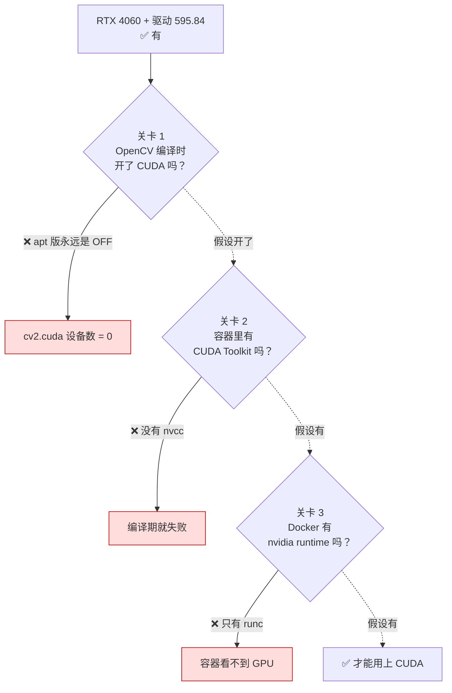

# 为什么装的 OpenCV 没有 CUDA？（本机明明支持）

::: tip 这一页回答什么
本机是 RTX 4060，驱动装好了，`nvidia-smi` 也正常。但容器里的 OpenCV 一个 CUDA 设备都看不到。

这不是装错了，是**四道关卡一道都没通**。这一页把四道关卡逐个拆开，并给出"要不要补"的判断依据。
:::

## 1. 先确认事实，别猜

三条命令，从"硬件有没有"一路查到"OpenCV 用不用得上"。

### 1.1 硬件和驱动：有

```bash
nvidia-smi --query-gpu=name,driver_version,memory.total --format=csv
```

真实输出【运行验证】：

```
name, driver_version, memory.total [MiB]
NVIDIA GeForce RTX 4060 Laptop GPU, 595.84, 8188 MiB
```

**GPU 在，驱动在。** 所以问题不在硬件。

### 1.2 CUDA 工具链：没有

```bash
which nvcc || echo "(没有 nvcc)"
```

```
(没有 nvcc)
```

::: warning 驱动 ≠ 工具链，这是第一个要分清的概念
- **驱动**（`nvidia-smi` 能跑就说明有）：让操作系统能**驱动**这块显卡。玩游戏、看视频、跑别人已经编译好的 CUDA 程序，只要驱动就够。
- **CUDA Toolkit**（`nvcc` 是它的编译器）：让你能**编译**用到 CUDA 的代码。

`nvidia-smi` 显示的那个 "CUDA Version" 是**驱动最高能支持到的版本**，不代表你装了 Toolkit。**很多人在这里误判**，以为看到 CUDA 版本号就等于装了 CUDA。
:::

### 1.3 容器里的 OpenCV：看不到 CUDA 设备

```bash
sudo docker run --rm local/ego-planner-humble:latest bash -lc \
  'python3 -c "import cv2; print(\"版本:\", cv2.__version__); print(\"CUDA 设备数:\", cv2.cuda.getCudaEnabledDeviceCount())"'
```

```
版本: 4.5.4
CUDA 设备数: 0
```

`0` 就是答案本身。下面解释这个 `0` 是怎么来的。

## 2. 四道关卡，一道都没通



### 关卡 1：apt 的 `libopencv-dev` **从来不带** CUDA

这是最根本的一道，也是最反直觉的一道。

::: warning 核心概念：CUDA 支持是**编译期**决定的，不是运行期
OpenCV 要不要支持 CUDA，是在**编译 OpenCV 自己**的时候，由一个 CMake 开关决定的：

```
-DWITH_CUDA=ON
```

开了 `ON`，编译过程就会去调用 `nvcc`，把 GPU 版的算子编进 `.so` 文件里。关了（默认 `OFF`），那些代码**根本不存在于二进制里**。

所以运行时你换什么显卡、装什么驱动，都不可能让一个 `WITH_CUDA=OFF` 编出来的 OpenCV 突然会用 GPU。**那段机器码不在文件里，不是"没启用"，是"没有"。**
:::

而 Ubuntu 官方仓库里的 `libopencv-dev`，**编译时一定是 `WITH_CUDA=OFF`**。原因很实在：

| 原因 | 说明 |
| --- | --- |
| 依赖问题 | 带 CUDA 就要依赖 NVIDIA 的闭源 Toolkit，Ubuntu main 仓库不能这么做 |
| 通用性 | 这个包要装在所有机器上，包括没有 NVIDIA 显卡的 |
| 体积 | 带 CUDA 的 OpenCV 库体积会涨好几倍（要为多个 GPU 架构各编一份） |

**结论：只要你的 OpenCV 是 `apt install libopencv-dev` 来的，它就没有 CUDA。这跟你的机器是什么配置完全无关。**

想要 CUDA 版的 OpenCV，**只有一条路：自己从源码编，并且带上 `-DWITH_CUDA=ON`。**

::: tip 记忆方法
把编译开关想成**出厂配置**。一辆出厂没装天窗的车，你后来买了多贵的遮阳帘都开不出天窗来。

`nvidia-smi` 正常 = 你家有阳光；`WITH_CUDA=OFF` = 车顶是实心的。**两件事互不相干。**
:::

### 关卡 2：容器里没有 CUDA Toolkit

就算我们想自己编，容器里也没有 `nvcc`。宿主机也没有（见 1.2）。

要补上就得在镜像里装 CUDA Toolkit——**这一步就要几个 GB**，而且要选对和驱动匹配的版本。

### 关卡 3：Docker 没有 NVIDIA runtime

这一关最容易被忽略：**容器默认看不到 GPU。**

```bash
sudo docker info --format '{{json .Runtimes}}'
```

真实输出里只有两个名字【运行验证】：

```
io.containerd.runc.v2 、 runc
```

**没有 `nvidia`。** 要让容器用上 GPU，需要装 `nvidia-container-toolkit`，它会给 Docker 注册一个 `nvidia` runtime，之后才能：

```bash
docker run --gpus all ...
```

验证本机确实没装【运行验证】：

```bash
which nvidia-container-runtime nvidia-container-cli || echo "(没有)"
```

```
(没有)
```

::: warning 最常见的误解：`/dev/dri` 不是 CUDA
我们的 `run-sitl.sh` / `run-vins.sh` 里都有这么一段，把显卡设备传进容器：

```bash
for dev in /dev/dri/card* /dev/dri/renderD*; do
  [[ -c "$dev" ]] && dri_args+=(--device "$dev")
done
```

看到"把显卡传进去了"很容易以为 GPU 已经能用了。**但 `/dev/dri` 和 CUDA 是两条完全不同的路：**

| | `/dev/dri` | CUDA |
| --- | --- | --- |
| 是什么 | Linux 的 DRM 图形设备节点 | NVIDIA 的通用计算接口 |
| 谁在用 | Mesa / OpenGL，也就是**画图** | cuDNN、OpenCV CUDA 模块，也就是**算数** |
| 我们为什么传它 | 让 **Gazebo 和 RViz** 硬件加速渲染，不至于软件渲染卡成幻灯片 | 我们没有传，也没法这么传 |
| 怎么给容器 | `--device /dev/dri/...` | `--gpus all` + nvidia-container-toolkit |

**记法：`/dev/dri` 管"画得快不快"，CUDA 管"算得快不快"。传了前者不等于有了后者。**
:::

## 3. 那要不要补上？

补齐三道关卡的成本是明确的：装 CUDA Toolkit（几 GB）+ 装 nvidia-container-toolkit（要 sudo apt）+ 从源码编一份 CUDA 版 OpenCV（编译时间很长，且要为 RTX 4060 的 `sm_89` 架构指定 `CUDA_ARCH_BIN`）。

收益却比想象的小得多，有三条具体理由。

### 理由 1：VINS 的 GPU 加速只覆盖前端，瓶颈通常在后端

VINS-Fusion 的计算分两块：

| 模块 | 干什么 | 能不能 GPU 加速 |
| --- | --- | --- |
| 前端 特征跟踪 | 提角点、光流跟踪 | **能**（这是 GPU fork 优化的部分） |
| 后端 滑动窗口 BA | Ceres 非线性优化 | **不能**，Ceres 这里是 CPU 计算 |

后端的 Ceres 优化通常才是耗时大头。**把前端加速三倍，总耗时可能只降一点点**——这是典型的"优化了不是瓶颈的那一段"。

::: tip 一个通用的判断习惯
在动手做任何性能优化之前，先问：**我要加速的这一段，占总时间的多少？**

如果它只占 20%，那就算加速到无限快，总时间也只能降 20%。这叫 Amdahl 定律，但不用记名字，记住那句问话就够。
:::

### 理由 2：VINS 的 GPU 分支要 OpenCV 3.4.1，和 Humble 的 4.5.4 冲突

社区那份带 GPU 的 VINS-Fusion fork 是针对 **OpenCV 3.4.1** 写的（CUDA 相关的 API 在 4.x 里改过）。

而 ROS 2 Humble 的 `cv_bridge` 是链接到系统的 **OpenCV 4.5.4** 的。同一个进程里混进两个大版本的 OpenCV，会出现符号冲突——**这类问题的症状是运行时莫名段错误，非常难查**。

### 理由 3：我们现在的目标不是快，是**跑通**

现阶段要回答的问题是"VINS 能不能在 EuRoC 上正确输出轨迹"，用的是**离线数据集**——数据集可以慢放，不存在实时性要求。

::: tip 什么时候才真的需要 CUDA
等到这两个条件同时成立时再回来做这件事：

1. 已经跑到**实机 / 实时**阶段（RealSense 出图，必须跟上帧率）
2. 已经**测量过**，确认瓶颈真的在前端特征跟踪（不是猜的）

在那之前，这属于"看起来很专业但不解决任何当前问题"的工作。
:::

## 4. 结论

| 问题 | 答案 |
| --- | --- |
| 本机支持 CUDA 吗 | **支持**。RTX 4060 + 驱动 595.84【运行验证】 |
| 那 OpenCV 为什么没有 | 因为它是 `apt` 装的，而 apt 版**编译时就关掉了** CUDA。运行期无法补救 |
| 传了 `/dev/dri` 不算吗 | 不算。那是给 Gazebo/RViz **画图**用的，和 CUDA **算数**是两条路 |
| 容器现在能看到 GPU 吗 | 看不到。Docker 里只有 `runc`，没有 `nvidia` runtime【运行验证】 |
| 现在要补上吗 | **不补。** 收益小（只加速前端）、冲突多（OpenCV 3.4 vs 4.5）、当前不需要（跑离线数据集） |

## 记忆卡：编译期 vs 运行期

::: info 一句话理解
一个库支持什么功能，往往在**编译它的时候**就定死了；运行时换硬件、装驱动都改不了。查一个功能"为什么没有"，要先查它**编译时开没开**。
:::

**三个关键词：** 编译期开关（`WITH_CUDA`）、驱动 vs 工具链、容器 GPU 直通（nvidia runtime）

**三层都要通，缺一层就是 0**

| 层 | 要什么 | 怎么查 |
| --- | --- | --- |
| 库 | OpenCV 编译时 `WITH_CUDA=ON` | `cv2.cuda.getCudaEnabledDeviceCount()` |
| 编译环境 | CUDA Toolkit（`nvcc`） | `which nvcc` |
| 容器 | nvidia runtime | <code v-pre>docker info --format '{{json .Runtimes}}'</code> |

## 自测题

::: details 1. `nvidia-smi` 里显示 "CUDA Version: 13.0"，是不是说明我装了 CUDA？
不是。那个数字是**驱动最高能支持到的 CUDA 版本**，不代表系统里有 CUDA Toolkit。

判断有没有 Toolkit 要看编译器：

```bash
which nvcc
```

本机的结果是**没有**【运行验证】——驱动有，Toolkit 没有。
:::

::: details 2. 我给容器传了 `--device /dev/dri/card0`，OpenCV 能用 GPU 了吗？
不能。`/dev/dri` 是 Linux 的 DRM 图形设备，服务的是 Mesa/OpenGL 这条**渲染**路径——我们传它是为了让 **Gazebo 和 RViz** 别退化成软件渲染。

CUDA 是另一条路，需要 `nvidia-container-toolkit` 提供的 `nvidia` runtime 加上 `--gpus all`。

**`/dev/dri` 管画得快不快，CUDA 管算得快不快。**
:::

::: details 3. 装个更新的显卡驱动，能让 apt 版 OpenCV 用上 CUDA 吗？
不能，一点用都没有。`WITH_CUDA=OFF` 编出来的 `.so` 文件里**根本没有那段 GPU 代码**——不是"有但没启用"，是"不存在"。

想要就只能从源码重编 OpenCV 并加 `-DWITH_CUDA=ON`。

**这是"编译期决定"和"运行期配置"的区别，是本页最该带走的一条。**
:::

::: details 4. 为什么本项目决定"暂时不补 CUDA"？
三条理由，任何一条单独都够：

1. **收益小**：VINS 的 GPU 加速只覆盖前端特征跟踪，后端 Ceres 的滑动窗口 BA 仍是 CPU，而后端往往才是耗时大头。
2. **冲突多**：带 GPU 的 VINS fork 是针对 OpenCV 3.4.1 写的，而 Humble 的 `cv_bridge` 链的是 4.5.4。混用两个大版本会出运行时段错误，极难排查。
3. **现在不需要**：跑的是离线数据集，可以慢放，没有实时性要求。

判断标准：等到**实机实时**阶段，并且**测量过**瓶颈确实在前端，再回来做。
:::

