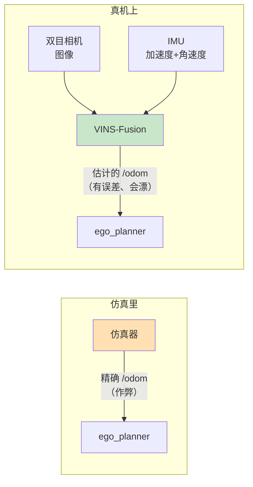

# 第六步：装 VINS-Fusion（视觉惯性里程计）

::: tip 这一页你会得到什么
一个能跑的 VINS-Fusion（ROS 2 版）：镜像、编译好的四个包、一份转成 ROS 2 格式的 EuRoC 数据集，以及一次完整的运行验收。

**五条命令**，从零到出轨迹：

```bash
bash environments/vins-humble/fetch-source.sh    # 1. 拉源码，钉死 commit
bash environments/vins-humble/build-image.sh     # 2. 构建镜像
bash environments/vins-humble/fetch-dataset.sh   # 3. 下数据集并转格式
bash environments/vins-humble/run-vins.sh build  # 4. 编译 4 个包
bash environments/vins-humble/run-vins.sh start  # 5. 起节点，然后 run-vins.sh play
```

只想跑通的话，照着第 3、5、6、7 节走就行。第 4 节是这个镜像建了 6 次才成的记录，**急着跑通可以跳过**，遇到报错再回来查。
:::

## 1. 先搞清楚 VINS 在整条线里是什么位置

前面 EGO-Planner 的仿真里，无人机的位置是**仿真器直接告诉它的**——`ego_planner` 订阅一个 `/odom` 话题，那个话题由仿真器凭空生成，永远精确。

真机上没有这种好事。真机要靠传感器**自己算出**「我在哪」。这就是 VINS 干的事。



| | 输入 | 处理 | 输出 |
| --- | --- | --- | --- |
| VINS-Fusion | 双目图像 + IMU | 前端提特征跟踪，后端滑动窗口非线性优化 | 位姿（位置 + 姿态）和轨迹 |

::: info 为什么要"视觉"加"惯性"两种传感器
两者的毛病刚好互补，这是 VIO 这套方法的全部动机：

| | 优点 | 致命缺点 |
| --- | --- | --- |
| 相机 | 长期不漂，能看到"回到原地了" | 快速运动会糊；纯白墙上没特征可跟 |
| IMU | 频率高（几百 Hz），再快的动作也跟得上 | **积分漂移**，误差随时间平方增长，几秒就没用 |

合起来：IMU 负责短时间内的高频推算，相机负责不断把长期漂移拽回来。**记法：IMU 管"这一瞬间"，相机管"别越走越偏"。**
:::

::: warning VIO 不等于定位全解决
VINS 输出的是**相对起点**的位姿，而且会慢慢漂。它没有 GPS 那种全局坐标。所以真机上通常还要和其他源融合——这也是这份代码里有个包叫 `global_fusion` 的原因。
:::

## 2. 为什么用 `zinuok/VINS-Fusion-ROS2` 这个 fork

VINS-Fusion 的官方仓库（HKUST-Aerial-Robotics）只有 ROS 1 版本。我们的环境是 ROS 2 Humble，所以需要一个移植版。

本项目钉死的是【运行验证】：

```text
仓库：https://github.com/zinuok/VINS-Fusion-ROS2
分支：main
commit：72023bc5d2abb14faa4c02a5c040d84f996b587a
```

::: tip 为什么一定要钉 commit 而不是只写分支名
`main` 分支明天可能就变了。如果只写分支名，你今天照着这份文档走通了，下个月同学照着走可能编不过，而且**你们俩都不知道差在哪**。

钉死 commit 等于给"能跑通"这件事拍了张照。这是可复现性最便宜的一步——一行字，省掉将来无数小时。
:::

## 3. 命令一：拉源码并钉死 commit

```bash
bash environments/vins-humble/fetch-source.sh
```

这一步做三件事：在 `~/Documents/Codex/vins-humble/src/` 下克隆仓库、`git checkout` 到那个 commit、把 `build-workspace.sh` 复制进工作空间。

::: info 为什么要把脚本复制进工作空间
因为编译是在**容器里**跑的，容器只挂载了工作空间目录（`-v $WORKSPACE:/workspace`）。仓库里的脚本容器看不见，所以要先放进去。

这也意味着：**每次改了 `build-workspace.sh`，都要重新跑一次 `fetch-source.sh`**（或手动复制），否则容器执行的还是旧版本。我在这上面浪费过时间。
:::

脚本是幂等的。已经克隆过就只校验 commit，不会重新下载。

## 4. 命令二：构建镜像

```bash
bash environments/vins-humble/build-image.sh
```

这个镜像的思路和 PX4 那个一样：**`FROM local/ego-planner-humble:latest`**，复用已经验证过的 Humble + CycloneDDS 底座，绝不去动那个能跑的 EGO 镜像。

真正要加的东西只有两样：Ceres（非线性优化库，VINS 后端的核心）和 `rosbags`（转数据集用）。

听起来是两行 apt。**实际建了 6 次。** 下面按遇到的顺序讲，每个坑都给"看到什么现象 → 真正原因 → 怎么修"。

### 4.1 坑一：编译脚本"什么都没做"

现象：跑 `build-workspace.sh`，日志里只有一行：

```text
/opt/ros/humble/setup.bash: line 8: AMENT_TRACE_SETUP_FILES: unbound variable
```

然后就结束了。`colcon` **一次都没跑**。

原因：我脚本开头写的是所有人都习惯写的那句：

```bash
set -euo pipefail
source /opt/ros/humble/setup.bash
```

`set -u` 的意思是"用到未定义的变量就报错退出"。而 ROS 2 的 `setup.bash` **内部就会读未定义的变量**（`AMENT_TRACE_SETUP_FILES` 是它的调试开关，正常情况下就是没定义的）。于是脚本在第 2 行就死了。

修法——先只开 `-e`，`source` 完再补 `-u`：

```bash
set -eo pipefail
source /opt/ros/humble/setup.bash
set -u
```

后面再 source `install/setup.bash` 时同理，要临时关掉：

```bash
set +u; source /workspace/install/setup.bash; set -u
```

::: warning 这个坑的真正教训不是那个变量名
是**"日志很短"本身就是一条线索**。

一个应该跑 10 分钟的编译，日志只有 1 行 —— 说明它不是"编译失败"，是"根本没开始"。这两种情况要往完全不同的方向查：
- 编译失败 → 查代码、查依赖
- 没开始 → 查脚本自己前几行、查环境变量、查文件有没有真的被复制进去

我一开始盯着 ROS 环境查了很久，因为报错里有 `ros/humble` 这个路径，看起来像"ROS 装坏了"。其实 ROS 一点问题都没有。
:::

### 4.2 坑二：Ceres 版本不对，而且**不能靠改代码绕过**

修好脚本之后，`colcon` 终于跑起来了，`global_fusion` 这个包编译失败：

```text
error: ‘Manifold’ is not a member of ‘ceres’
error: ‘quaternion_manifold’ was not declared in this scope
```

原因：Ubuntu 22.04 的 apt 里，`libceres-dev` 是 **Ceres 2.0.0**。而 `Manifold` 这套 API 是 **Ceres 2.1 才引入**的。

::: info Ceres 是什么、Manifold 又是什么
**Ceres** 是 Google 开源的非线性最小二乘优化库。VINS 的后端本质就是在解一个大优化问题："给定这一串图像观测和 IMU 读数，最可能的一串位姿是什么？" Ceres 就是解这个的。

**Manifold（流形）** 解决的是一个具体的数学麻烦：旋转不能像普通数字那样加减。

用四元数表示旋转要满足"模长等于 1"这个约束。优化器如果直接给四元数的 4 个数各加一点增量，结果模长就不是 1 了，那就不是一个合法旋转。

Manifold 就是告诉优化器："这个量不住在普通的平直空间里，它住在一个弯曲的流形上。加增量要按我给的规则加。" Ceres 2.1 之前这套东西叫 `LocalParameterization`，2.1 起改名重构成了 `Manifold`。

**记法：Manifold 是在教优化器"怎么给旋转做加法"。**
:::

我第一反应是改代码适配 2.0（毕竟只是改个类名？）。查完发现**不能这么干**——`Manifold` 不是零星用了几处，而是贯穿全部四个包【源码确认】：

| 文件 | 用法 |
| --- | --- |
| `vins/src/factor/pose_local_parameterization.h` | `class ... : public ceres::Manifold`（**继承**） |
| `camera_models/.../EigenQuaternionParameterization.h` | 同样继承 `ceres::Manifold` |
| `loop_fusion/src/pose_graph.h` | `ceres::AutoDiffManifold<...>` |
| `global_fusion/src/globalOpt.cpp` | `ceres::QuaternionManifold` |

改回 2.0 的 `LocalParameterization` 要重写 `Plus` / `PlusJacobian` / `Minus` / `MinusJacobian` 四个雅可比函数，而 `AutoDiffManifold` 在 2.0 里**根本没有对等物**。

::: warning 我决定不改代码的关键理由（这条比 Ceres 本身重要）
**雅可比写错不会报错。** 编译能过，程序能跑，轨迹也能出来——只是精度悄悄变差。

这类 bug 极其难发现，因为没有任何东西会提示你出错了。你会以为"VINS 就这个水平"，然后花几天去调参数，而问题在你自己三个月前手写的那个矩阵里。

**判断准则：当一个改动的错误后果是"静默降级"而不是"明确报错"时，要极力避免。** 宁可多花 10 分钟编译一个正确的依赖版本。
:::

所以正确做法是：**给代码它本来就需要的 Ceres 版本，一行第三方源码都不改。** Dockerfile 里从源码编 Ceres 2.2.0 装到 `/usr/local`，同时**故意不装** `libceres-dev`。

层的最后一行是一个自检：

```dockerfile
test -f /usr/local/include/ceres/manifold.h    # 装错了就在这里失败，别等编译 VINS 才发现
```

::: tip 这个 test 是一个值得养成的习惯
**在装完东西的那一层立刻验证它装对了**，而不是等到几十分钟后用到它的时候才发现。

失败离原因越近，排查越便宜。同样的思路在 `build-workspace.sh` 里也放了一份，编译前先检查 `manifold.h` 存不存在。
:::

### 4.3 坑三：为了下 Ceres 加了代理，结果把 apt 搞坏了

Ceres 源码在 GitHub 上，这个网络直连 GitHub 不通，得走代理。我的第一版写法是最直觉的那种：

```bash
sudo docker build --build-arg http_proxy="$http_proxy" --build-arg https_proxy="$https_proxy" ...
```

结果 apt 直接崩了【运行验证】：

```text
E: Failed to fetch .../jammy/InRelease  502  Bad Gateway [IP: 127.0.0.1 17892]
```

::: warning 核心知识：`http_proxy` 是 Docker 的**预定义** build arg
Docker 对少数几个名字有特殊待遇：`http_proxy`、`https_proxy`、`no_proxy`、`ftp_proxy` 等。

用 `--build-arg` 传这些名字时，Docker **不只是**把它们变成一个可用的变量，而是把它们注入成**所有 `RUN` 步骤的环境变量**。

于是本来直连正常的 apt 也被迫走代理，而本机这个代理对 `archive.ubuntu.com` 返回 502。**我为了让一条 `wget` 能联网，把整个镜像的网络都改了。**
:::

修法：用一个**自定义名字**的 build arg，在 Dockerfile 里只贴在那一条命令前面。

```dockerfile
ARG GITHUB_PROXY=
RUN set -eux; \
    https_proxy="$GITHUB_PROXY" http_proxy="$GITHUB_PROXY" \
      wget -q "https://github.com/ceres-solver/..." -O ceres.tar.gz; \
    ...
```

```bash
sudo docker build --build-arg GITHUB_PROXY="${https_proxy:-}" ...
```

`GITHUB_PROXY` 不是预定义名字，Docker 不会做任何特殊处理，它只是一个普通变量。**谁需要代理谁用，互不影响。**

::: tip 记忆方法
把预定义 build arg 想成"全局开关"，自定义 build arg 想成"局部开关"。

需要给一扇窗开条缝，别去拉总电闸。**作用域越小越安全**，这在配置、权限、变量上都成立。
:::

### 4.4 坑四：`--network host` 把宿主机坏掉的 IPv6 也带进了容器

为什么要 `--network host`：代理跑在宿主机的 `127.0.0.1:17892`。docker build 默认用 bridge 网络，容器里的 `127.0.0.1` 指的是**容器自己**，`wget` 会**静默等到超时**（PX4 编译期 clone eProsima 卡住是同一个成因）。只有 host 网络才能让容器里的 `127.0.0.1` 就是宿主机的 `127.0.0.1`。

代价是：容器把宿主机的网络栈整个继承了，包括宿主机那个**有 IPv6 地址但没有可用 IPv6 路由**的状态。apt 解析域名拿到 AAAA 记录，就去连 IPv6【运行验证】：

```text
Cannot initiate the connection to archive.ubuntu.com:80 (2a06:bc80:0:1000::18).
  - connect (101: Network is unreachable)
```

而下游的报错完全看不出跟 IPv6 有关：

```text
E: Package 'libgflags-dev' has no installation candidate
```

修法是给 apt 强制走 IPv4：

```dockerfile
RUN apt-get -o Acquire::ForceIPv4=true update && apt-get install -y ...
```

::: danger 然后我发现：这个修法**没解决问题**
加了 `ForceIPv4` 重建，**照样失败**，只是报错换了一句：

```text
Unable to connect to archive.ubuntu.com:80: [IP: 91.189.92.23 80]
```

IPv6 那条报错是真的，我修的也是真的，但它**不是根因**——真正的原因是下一节。

**这是这一页最该带走的一条：日志里第一条显眼的错误，不一定是根因。** 尤其当那条错误看起来很专业、很有解释力的时候，最容易让人停止思考。

改完必须重跑验证。「我找到原因了」和「问题解决了」是两件事，中间隔着一次验证。
:::

`ForceIPv4` 我留下了——它确实省掉一轮无用的超时等待，只是它不是答案。

### 4.5 坑五（真正的根因）：这个网络封了 Ubuntu 官方源的 80 端口

拿到 `Unable to connect ...:80` 之后，我不再猜了，直接在**宿主机**上一条条测。这是四条命令，你换网络遇到问题时应该照着测一遍：

```bash
t() { timeout 10 curl -s -o /dev/null -w "%{http_code} %{time_total}s" --noproxy '*' "$1" || echo 失败; }
echo "http  archive : $(t http://archive.ubuntu.com/ubuntu/dists/jammy/InRelease)"
echo "https archive : $(t https://archive.ubuntu.com/ubuntu/dists/jammy/InRelease)"
echo "http  security: $(t http://security.ubuntu.com/ubuntu/dists/jammy-security/InRelease)"
echo "http  阿里镜像 : $(t http://mirrors.aliyun.com/ubuntu/dists/jammy/InRelease)"
```

真实输出【运行验证】：

```text
http  archive : 失败
https archive : 200 4.279969s
http  security: 失败
http  阿里镜像 : 200 0.329926s
```

结论一目了然：**这个网络屏蔽（或严重限速）了 Ubuntu 官方源的 80 端口，443 端口是通的。**

::: info 那为什么宿主机的 apt 一直好好的？
因为宿主机 Ubuntu 24.04 的源列表里写的是 `https://archive.ubuntu.com/ubuntu`（走 443），而 `ubuntu:22.04` 基础镜像自带的 `sources.list` 写的是 `http://`（走 80）。

**同一台机器、同一个网络，一个能用一个不能用，差别只在协议。**
:::

::: warning 那为什么 EGO 镜像当初能建成功？
因为它的 apt 层**早就编好并被 Docker 缓存了**，之后每次重建都直接命中缓存，`apt-get` 根本没有真正执行过。

**「以前能建」不等于「现在能建」——构建缓存会掩盖网络退化。** 这也是为什么一个几个月没动过的 Dockerfile，某天从头构建时会突然崩掉一堆。
:::

修法：把容器里的 apt 源换成国内镜像。做成 build arg，好让换网络的读者能覆盖回官方源：

```dockerfile
ARG APT_MIRROR=http://mirrors.aliyun.com/ubuntu
RUN set -eux; \
    sed -i -E "s#https?://(archive|security)\.ubuntu\.com/ubuntu#${APT_MIRROR}#g" \
      /etc/apt/sources.list; \
    grep -c "$APT_MIRROR" /etc/apt/sources.list    # 一条都没替换到就在这里失败
```

想用官方源就这样覆盖：

```bash
sudo docker build --build-arg APT_MIRROR=https://archive.ubuntu.com/ubuntu ...
```

::: info 为什么不干脆改成 https 官方源（那样最"通用"）
测过了，不实用【运行验证】：`InRelease` 要 4.3 秒（镜像 0.2 秒，慢 20 倍），实际下 `.deb` 包时更慢到 40 秒超时都没下完。

镜像源不是"为了快一点"，是**不换就装不上**。
:::

最后那行 `grep -c` 又是一个立刻自检：万一将来基础镜像换了源格式（比如 24.04 用的是 `.sources` 新格式，不再是 `sources.list`），`sed` 会一条都替换不到，**这一层就当场失败**，而不是留到 apt 阶段报一句看不懂的话。

### 4.6 坑六：`wget: not found`，退出码 127

换完源，apt 层终于过了。下一层立刻：

```text
/bin/sh: 1: wget: not found
The command '/bin/sh -c set -eux; cd /tmp; ... ' returned a non-zero code: 127
```

基础镜像里没有 `wget`。修法就是把它加进上一层的 apt 列表（连带 `ca-certificates`，https 校验证书要用）。

::: tip 记住这个数字：退出码 127 = 命令找不到
| 退出码 | 含义 |
| --- | --- |
| 126 | 找到了但**不能执行**（权限不对、不是可执行文件） |
| **127** | **命令根本不存在** |
| 128+N | 被信号 N 杀死（如 137 = 128+9，被 SIGKILL，常见于内存不够被 OOM killer 干掉） |

看到 127 先想"这个命令装了吗"，别去检查参数拼写。这几个数字能省下很多无谓的排查。
:::

### 4.7 坑七：长构建被"连坐"杀掉，以及顺手堵掉的一个 OOM 隐患

Ceres 编到 58% 时，日志**停住了**：没有报错，没有 `returned a non-zero code`，什么都没有，就是不再往下写了。

先别急着猜。用两条命令把"卡住"和"死了"区分开：

```bash
stat -c '%y' 构建日志          # 日志最后一次被写是什么时候
pgrep -af 'docker build'      # 构建进程还在不在
```

结果是日志 2.5 小时没动过，进程也**不存在了**【运行验证】。所以不是卡住，是整个进程被杀了。

原因：我把构建放在一个跟着当前会话的后台任务里。会话中断时，整个进程组被 SIGKILL 连坐带走了。**Docker 构建本身没有任何问题。**

::: tip 长构建要真正脱离会话
不要只加 `&`。用 `setsid` 把它放进一个新的会话，这样父进程死了也不会连坐：

```bash
setsid nohup bash build-image.sh > 构建日志 2>&1 < /dev/null &
```

`setsid` 新建会话（脱离原进程组）、`nohup` 忽略挂断信号、`< /dev/null` 断开标准输入，三个一起用。

**判断依据：一个动作要跑几十分钟，就该假设你的终端撑不到它结束。**
:::

顺便查了内存，发现一个还没爆但迟早要爆的隐患【运行验证】：

```text
内存：15Gi 总量，可用 8.2Gi
nproc：32
```

而我的 Dockerfile 里写的是所有教程都这么写的那句：`cmake --build ceres-build -j"$(nproc)"`。

::: danger 32 个并行编译 Ceres，在 8 GB 可用内存上是在赌
Ceres 是重度模板代码，**单个编译单元峰值能吃到 1 GB 上下**。32 个并行意味着峰值可能要 30 GB 以上，而这台机器只有 8 GB 可用（另外 7 GB 被还在跑的 EGO 仿真容器占着）。

这次日志里**没有** OOM 的痕迹，所以这次不是 OOM——但这属于"这次运气好"。我把它改成了 `-j6`，做成 build arg 可覆盖：

```dockerfile
ARG CERES_JOBS=6
...
cmake --build ceres-build -j"$CERES_JOBS"
```

内存大的机器自己调：`--build-arg CERES_JOBS=16`。
:::

::: warning 为什么要专门堵这个：OOM 的现象特别难认
内存不够时，内核**直接 SIGKILL** 掉编译器进程。你看到的可能是：

```text
c++: fatal error: Killed signal terminated program cc1plus
```

也可能**什么都不打印**，日志就那么断了——和"网络卡住""构建挂起"长得一模一样。

`-j$(nproc)` 是网上抄来的默认写法，它隐含一个假设："核数和内存是配套的"。笔记本、CI 容器、共享服务器上这个假设经常不成立。**核数决定能跑多快，内存决定能跑多少并行，两者要分开考虑。**

判断 OOM 的三个证据：`dmesg | grep -i oom-kill`、`free -h` 看可用量、日志里有没有 `Killed`。
:::

## 5. 命令三：下载 EuRoC 数据集并转成 ROS 2 格式

```bash
bash environments/vins-humble/fetch-dataset.sh
```

我们暂时没有真实的双目相机 + IMU，所以用**公开数据集**代替。EuRoC MAV 数据集是 VIO 领域的标准测试集，`MH_01_easy` 是其中最简单的一段：一架无人机在苏黎世联邦理工的机械厅里飞了一圈。

用数据集而不是真机，好处是**它是可重复的**：同样的输入应该得到同样的输出。真机上每次飞的轨迹都不一样，算法改好了还是改坏了根本看不出来。

### 5.1 为什么必须转换

EuRoC 是 2016 年的数据集，官方发布的是 **ROS 1 bag**（文件头是 `#ROSBAG V2.0`）。ROS 2 的 `ros2 bag play` 读不了 —— 两者的容器格式完全不同。

转换用现成工具 `rosbags`（纯 Python，**不需要装 ROS 1**）。另一个方案 `rosbag2_bag_v2` 反而要求装 ROS 1，更麻烦。

::: warning `--dst-version 6` 不是可选项
脚本里这个参数必须写：

```bash
rosbags-convert --src /data/MH_01_easy.bag --dst /data/MH_01_easy_ros2 --dst-version 6
```

不写的话，rosbags 0.11.5 默认写 metadata 版本 9（给更新的 ROS 2 发行版用的），里面把 `offered_qos_profiles` 写成**列表** `[]`，而 Humble 的 rosbag2 期望它是**字符串** `''`。

结果是：**bag 里的数据其实是好的**，但一执行 `ros2 bag info` 或 `ros2 bag play` 就报【运行验证】：

```text
Exception on parsing info file: yaml-cpp: error at line 25, column 29: bad conversion
```

一个完全看不出跟版本有关的错误。版本 6 是 Humble 能读的格式。
:::

### 5.2 数据集从哪下

脚本里用的是 HuggingFace 上的镜像，不是 ETH 官方地址。原因【运行验证】：本机直连 `robotics.ethz.ch` 超时，走代理 https 返回 `code=000`。镜像的文件头和体积与官方一致（`2,673,818,914` 字节）。

脚本做了三层校验，任何一层不过就当场失败：

| 校验 | 防的是什么 |
| --- | --- |
| 体积等于 2673818914 字节 | 下到一半的残缺文件 |
| 文件头包含 `#ROSBAG` | 下到的是 HTML 错误页而不是数据 |
| 转换后 `ros2 bag info` 能列出话题 | 转换本身失败但没报错 |

下载支持断点续传（`curl -C -`），网络断了重跑脚本会接着下，不从头开始。2.49 GB，慢。

### 5.3 验收：话题必须和配置文件对得上

脚本最后会打印 bag 里的话题。本项目的真实结果【运行验证】：

| 话题 | 消息数 |
| --- | --- |
| `/imu0` | 36820 |
| `/cam0/image_raw` | 3682 |
| `/cam1/image_raw` | 3682 |

::: tip 这三个数字要一起看，不要只看"有没有"
**IMU 和图像是 10:1。** 这正好对应 IMU 200 Hz、相机 20 Hz —— 和第 1 节讲的"IMU 频率高、相机频率低"完全吻合。

两个相机的帧数**完全相等**（都是 3682），说明双目是同步的。如果这两个数不一样，双目匹配会出问题，那才是真麻烦。

**验收不是"确认东西存在"，是"确认数字之间的关系符合物理预期"。** 光看到三个话题都在，看不出这些。
:::

话题名必须和配置文件里写的一致，否则 `vins_node` 会一直静静地等，不报错也不出结果：

```bash
grep -E 'imu_topic|image[01]_topic' \
  ~/Documents/Codex/vins-humble/src/VINS-Fusion-ROS2/config/euroc/euroc_stereo_imu_config.yaml
```

## 6. 命令四：编译四个包

```bash
bash environments/vins-humble/run-vins.sh build
```

这一步在容器里跑 `rosdep install` + `colcon build`。真实输出【运行验证】：

```text
Finished <<< camera_models [35.4s]
Finished <<< vins [36.5s]
Finished <<< loop_fusion [19.5s]
Finished <<< global_fusion [14.0s]

Summary: 4 packages finished [1min 12s]
```

四个包各管什么：

| 包 | 职责 |
| --- | --- |
| `camera_models` | 相机模型与畸变参数（针孔、鱼眼等），被其他包依赖 |
| `vins` | **主体**。前端特征跟踪 + 后端滑动窗口优化，出实时位姿 |
| `loop_fusion` | 回环检测。认出"我以前来过这儿"，把累积漂移拽回来 |
| `global_fusion` | 和 GPS 等全局源融合，把相对位姿变成全局位姿 |

::: info 为什么总用时（1min 12s）小于四个包相加（105.4s）
因为 `colcon` **并行编译**没有依赖关系的包。`camera_models` 必须先编（别的包依赖它），但 `loop_fusion` 和 `global_fusion` 可以同时编。

看到这个差值，说明并行生效了。如果总时间恰好等于各包相加，那是在串行 —— 通常意味着依赖关系写得过紧。
:::

编译脚本里有两处值得注意的设计：

```bash
test -f /usr/local/include/ceres/manifold.h    # 编译前先确认 Ceres 版本对
chown -R "$HOST_UID:$HOST_GID" build install log
```

第一行是**编译前自检**：Ceres 不对就当场失败，而不是等一分钟后报一堆看不懂的模板错误。

第二行解决属主问题：容器里是 root，不改属主的话 `build/` `install/` 全是 root 所有，宿主机上想删掉重编都要密码。**凡是容器往挂载目录写东西，就在同一个容器里顺手把属主改回来。**

## 7. 命令五：跑起来并验收

两个终端的事，分两条命令：

```bash
bash environments/vins-humble/run-vins.sh start   # 起 vins_node，它开始等数据
bash environments/vins-humble/run-vins.sh play    # 放数据集喂给它（约 3 分钟）
```

顺序不能反。`vins_node` 要先起来订阅话题，否则数据集开头那几秒的消息没人接。

看它有没有在出位姿：

```bash
bash environments/vins-humble/run-vins.sh status
```

### 7.1 先确认参数真的加载对了

`vins_node` 启动时会打印它读到的参数。**这一步比看轨迹重要** —— 参数读错了，轨迹一定是错的，但它照样会输出一条看起来挺像样的轨迹。

本项目实测确认的关键项【运行验证】：

| 参数 | 值 | 意义 |
| --- | --- | --- |
| `ROW` / `COL` | 480 / 752 | 图像分辨率，必须和数据集一致 |
| 重力 | 9.81007 | IMU 预积分要用 |
| 两个相机的外参 | 都已加载 | 双目缺一个就退化成单目 |

### 7.2 验收结果

数据集放完后的真实结果【运行验证】：

| 指标 | 实测 |
| --- | --- |
| 输出位姿数 | 1009 |
| 单次优化耗时 | `solver costs: 7~8 ms` |
| 轨迹范围 | 10.76 × 6.42 × 2.22 m |
| 终点位置 | (0.083, 0.393, 0.093) |
| 播放容器退出码 | `Exited (0)` |

轨迹范围 10.76 × 6.42 m 是个**机械厅该有的尺度**。如果算出来是几百米或者几厘米，那就是尺度估计崩了 —— 这是单目 VIO 的典型故障，双目一般不会。

### 7.3 最关键的一步验收：确认这不是假的

MH_01 这段数据是**绕一圈回到起点附近**的。终点 (0.083, 0.393, 0.093) 离原点约 **0.4 m**，而总行程 20 m 以上，看起来精度很好。

**但这个数字有可能是假的。** 如果 VINS 中途跟踪丢了并重新初始化，它会把当前位置重置到原点附近 —— 那样终点也会"恰好"离原点很近，纯属巧合。

所以必须查日志里有没有这些词【运行验证】：

```bash
sudo docker logs --tail 3000 vins_node 2>&1 | grep -iE 'restart|failure|lost|relocal' | head
```

本项目的结果是**一条都没有**。所以这 0.4 m 是真实的闭环精度。

::: warning 这一节是整页最该带走的东西
**一个"好看"的结果，要先排除它是故障造成的巧合，才能算好结果。**

如果我只看终点坐标就宣布"漂移 0.4 米，很棒"，而实际上中途丢过跟踪，那这个结论是错的，而且**错得毫无痕迹** —— 没有任何报错，数字还很漂亮。

判断准则：**当一个指标"好得让你高兴"的时候，先想一想有没有哪种故障也会产生这个数字。** 这和第 4.2 节不改雅可比是同一类思维 —— 提防那些不会报错的错。
:::

## 记忆卡：VINS-Fusion 环境

| 要点 | 内容 |
| --- | --- |
| VINS 解决什么 | 真机上没有仿真器喂的精确 `/odom`，位置得靠传感器自己算 |
| 为什么视觉+惯性 | IMU 管"这一瞬间"（高频但漂），相机管"别越走越偏"（不漂但会糊） |
| VIO 的局限 | 输出的是**相对起点**的位姿，会慢慢漂，没有全局坐标 |
| Ceres 版本 | 必须 **2.2.0 源码编**。apt 的 2.0.0 缺 `Manifold`（2.1 才有） |
| 为什么不改代码适配 2.0 | 要手写四个雅可比，**写错不报错，只让精度悄悄变差** |
| 数据集转换 | `rosbags-convert`，**必须** `--dst-version 6`，否则 Humble 读不了 |
| 编译产物 | 4 个包：`camera_models` / `vins` / `loop_fusion` / `global_fusion` |
| 启停顺序 | 先 `start`（起节点等数据）再 `play`（放数据），不能反 |
| 验收要看什么 | 参数是否加载对 → 轨迹尺度是否合理 → **有没有 restart/lost** |

**三条通用方法论（比 VINS 本身更值得记）：**

1. **验收看的是数字之间的关系，不是"东西存不存在"。** IMU:图像 = 10:1 印证了采样率，双目帧数相等印证了同步。
2. **提防不会报错的错。** 雅可比写错、参数读错、跟踪丢了又重初始化 —— 全都不报错。
3. **好看的结果要先排除它是故障的巧合。** 0.4 m 漂移必须配合"没有 restart"才成立。

## 自测题

::: details 1. 为什么仿真里跑 EGO-Planner 不需要 VINS，真机上就需要？
仿真里 `/odom` 是**仿真器凭空生成**的，永远精确 —— 相当于作弊。真机上没有任何东西会告诉飞机"你在哪"，必须靠传感器自己算出来，这就是 VINS 的工作。
:::

::: details 2. 相机和 IMU 各自的致命缺点是什么？为什么合起来就好了？
- 相机：快速运动会糊，纯白墙上没特征可跟。但**长期不漂**，能认出"回到原地了"。
- IMU：频率高（几百 Hz），再快的动作也跟得上。但**积分漂移**，误差随时间平方增长，几秒就没用。

互补：IMU 负责短时间的高频推算，相机负责不断把长期漂移拽回来。
:::

::: details 3. apt 里有 `libceres-dev`，为什么这个项目故意不装它？
apt 的是 **Ceres 2.0.0**，而这份代码用的 `Manifold` API 是 **2.1 才引入**的，会报 `‘Manifold’ is not a member of ‘ceres’`。

而且不能靠改代码绕过：`Manifold` 贯穿全部四个包，还有类**继承** `ceres::Manifold` 和 `ceres::AutoDiffManifold`（2.0 里根本没有对等物）。改回 2.0 要重写四个雅可比函数，**而雅可比写错不会报错，只会让精度悄悄变差**。所以从源码编 2.2.0，一行第三方代码都不改。
:::

::: details 4. 转换数据集时不加 `--dst-version 6` 会怎样？错误信息看得出原因吗？
bag 里的**数据其实是好的**，但 `ros2 bag info` / `ros2 bag play` 会报：

```text
Exception on parsing info file: yaml-cpp: error at line 25, column 29: bad conversion
```

完全看不出跟版本有关。真实原因是默认的 metadata 版本 9 把 `offered_qos_profiles` 写成列表 `[]`，而 Humble 期望字符串 `''`。
:::

::: details 5. 为什么必须先 `start` 再 `play`，反过来会怎样？
`vins_node` 要先起来**订阅话题**。如果先放数据，开头那几秒的消息没有订阅者，直接丢掉。

ROS 2 的话题是"发布即丢弃"（默认 QoS 下），不像队列会等消费者。数据集开头恰好是 VINS 初始化最需要的那段静止数据，丢了会影响初始化质量。
:::

::: details 6. 终点离原点只有 0.4 m，能直接说"精度很好"吗？
**不能。** 如果 VINS 中途跟踪丢失并重新初始化，它会把位置重置到原点附近 —— 终点也会"恰好"离原点很近，纯属巧合，而且不会有任何报错。

必须先确认日志里没有 `restart` / `failure` / `lost` / `relocal`：

```bash
sudo docker logs --tail 3000 vins_node 2>&1 | grep -iE 'restart|failure|lost|relocal'
```

一条都没有，这 0.4 m 才是真实的闭环精度。
:::

::: details 7. 编译四个包各用了 35.4+36.5+19.5+14.0 = 105.4 秒，为什么总时间只有 1min 12s？
因为 `colcon` **并行编译**没有依赖关系的包。`camera_models` 必须先编（别的包依赖它），但 `loop_fusion` 和 `global_fusion` 可以同时进行。

反过来说：如果总时间恰好等于各包相加，说明在串行编译，通常意味着依赖关系写得过紧。
:::

## 下一步

现在三个部件都单独验收过了：

| 部件 | 作用 | 状态 |
| --- | --- | --- |
| EGO-Planner | 规划：往哪飞 | ✅ 已验收 |
| VINS-Fusion | 定位：我在哪 | ✅ 已验收 |
| PX4 SITL | 飞控：怎么飞 | ✅ 已验收（[起飞闭环](/px4-sitl/environment#_12-起飞验收-让这架飞机真的飞起来)） |

**下一个里程碑是把它们接起来**，缺的那一环是 `px4ctrl` —— 它订阅 EGO-Planner 的规划输出，翻译成 PX4 能听懂的 MAVLink 指令。源码已经钉住（[Ethan-02/px4ctrl-ros2-fast-drone](https://github.com/Ethan-02/px4ctrl-ros2-fast-drone)），故意还没集成。

接之前要先想清楚**三个部件之间的数据流**：各自的话题名、坐标系约定、频率对不对得上。三个都能单独跑，不等于接起来就能跑 —— 接口不匹配是这一步最常见的失败原因，而且症状往往是"什么都不动，也不报错"。


接口核对与第一批适配结果见[第七步：对齐规划与飞控接口](/integration/interfaces)。目前只通过隔离消息测试，完整飞行闭环仍待验证。
